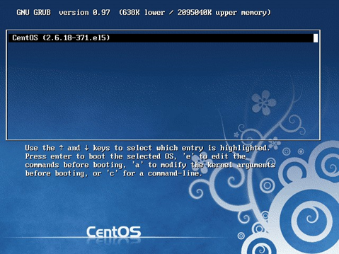
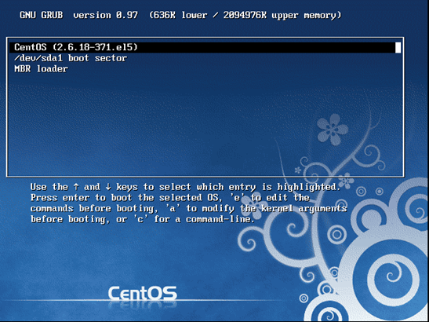
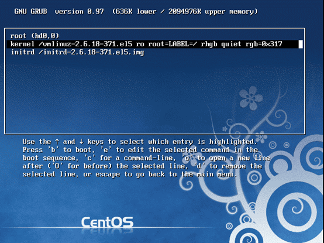

# Linux 学习记录--Boot Loader

# Boot Loader

Bootloader 的作用是加载内核到内存，使内核开始执行，Grub 是 linux 上面一个功能强大的 bootloader,当我们登陆系统就会看到如下界面，它就是 Grub 的 menu.lst，通过它我们可以选择不同的系统（多操作系统时）   
(这里介绍的是 grub，ubantu 使用的是 grub2，两者存在很多差异)   



## 功能介绍   
### menu .list   

menu.lst 是 Grub 的开机菜单，里面的配置决定了我们去哪里读取内核与 initrd    

```
default=0
timeout=5
splashimage=(hd0,0)/grub/splash.xpm.gz
hiddenmenu
title CentOS (2.6.18-371.el5)
        root (hd0,0)
        kernel /vmlinuz-2.6.18-371.el5 ro root=LABEL=/ rhgb quiet rgb=0x317
        initrd /initrd-2.6.18-371.el5.img
```

default: 默认启动项这个与 title 对照，menu 中配置了几个 title，启动菜单就有几个选择，0代表使用第一个 title 内容    
timeout:启动是的倒数读秒操作，-1代表不进行倒数读秒   
splashimage:menu.lst 的背景图片   
hiddenmenu:隐藏菜单   
root:代表内核文件放置那个分区，不是根目录的意思    
kernel:后面接内核文件名，在后面指定根目录挂载到那个分区   
initrd：后面接虚拟文件系统文件名（其实就是指定它的位置）    
(hd num1,num2): hd 代表在 grub 中硬盘与分区的代号，num1 代表硬盘代号(0开启)。Num2 代表分区号（0开始）.比如：内核文件存储在第一块硬盘的 D 分区（第2个分区），可以表示为(hd 0,1)     

**举例：menu.lst 配置说明**    

```
[root@localhost ~]# find / -name vmlinuz-2.6.1*;df 
/boot/vmlinuz-2.6.18-371.el5
文件系统               1K-块        已用     可用 已用% 挂载点
/dev/sda1               101086     11727     84140  13% /boot
```

通过上面我们可以看到内核文件存在/boot/vmlinuz-2.6.18-371.el5下，同时/boot 挂载到硬盘的第一分区，因此内核文件存储位置可以写成（hd 0,0）   

```
root (hd0,0)
kernel  /vmlinuz-2.6.18-371.el5 ro root=LABEL=/ rhgb quiet rgb=0x317
initrd  /initrd-2.6.18-371.el5.img
```

由于前面指定了 root 了因此后面的 kernel，initrd 只需写接下来的路径就可以了如：/vmlinuz-2.6.18-371.el5，接下来为根据 LABEL 挂载根目录到分区 root=LABEL=/    
同样上面配置也可以写成这样      

```
kernel  (hd0,0)/vmlinuz-2.6.18-371.el5 ro root=LABEL=/ rhgb quiet rgb=0x317
initrd  (hd0,0)/initrd-2.6.18-371.el5.img
```

### chain loader 控制权转移

我们知道 boot loader 装在 MBR 或者分区的第1扇区中，chain loader 功能就是将控制权交给指定分区的 bootloader 让其进行加载相应的内核文件   

```
title /dev/sda1 boot sector
        root (hd0,0)
        chainloader +1
```

比如我们的 LINUX 系统的 bootloader 装在了第1个硬盘第1个分区，那 bootloader 的位置就是第1块硬盘的第一个分区的第一扇区，因此    
root (hd0,0)指定分区与磁盘，这里是第一个磁盘的第一个分区    
chainloader +1 指定为第一扇区   

同样假如我们 LINUX 系统的 bootloader 再在整个硬盘的 MBR 中，那可以这么指定    

```
title   MBR loader
        root (hd0)
        chainloader +1
```
 
由于 MBR 位置为硬盘的一个扇区，因此   
root (hd0)指定第一个硬盘   
chainloader +1指定为第一扇区    

### 多系统并存环境

如果想让一台机器上存在多个操作系统可以通过控制权转移将控制权交给指定分区的 loader 进行加载相应的操作系统    

假如，我的机器只有一个硬盘，我想在第1分区装 WINXP,第2个分区装 linux,那个就可以在 menu.list 中设置2个选项，第1个选项为 winxp,第2个选项为 linux,当选择第一个时控制权交给第1分区的 bootloader,当选择第2分区时将控制权交给第2个分区的 bootloader 即 linux 的 loader   
 
但是这里需要先安装 WINXP 在安装 LINUX 因为 window 不具有控制权转移功能      


## Grub 安装   

**Grub 安装分为3个步骤**   
1.      grup 配置文件安装   
2.      menu.list 文件编辑  
3.      grup 主程序安装到 MBR 或分区第一扇区    

**步骤1：grub 配置文件安装**   

**语法：**grub-install[--root-directory=DIR] 设备代号   
**选项与参数**   
--root-directory：当指定 DIR 是，grub 配置文件安装在 DIR/boot/grub    
如不指定此属性，此默认安装在/boot/grub   

```
[root@localhost ~]# grub-install /dev/sda
Installation finished. No error reported.
This is the contents of the device map /boot/grub/device.map.
Check if this is correct or not. If any of the lines is incorrect,
fix it and re-run the script `grub-install'.
# this device map was generated by anaconda
(hd0)     /dev/sda 
[root@localhost lib]# ll /boot/grub/
-rw-r--r-- 1 root root   7584 03-31 10:52 e2fs_stage1_5
-rw-r--r-- 1 root root   7456 03-31 10:52 fat_stage1_5
```

**步骤2：编写 menu.list**   

```
[root@localhost lib]# vim /boot/grub/menu.lst
default=0
timeout=5
splashimage=(hd0,0)/grub/splash.xpm.gz
hiddenmenu
title CentOS (2.6.18-371.el5)
        root (hd0,0)
        kernel /vmlinuz-2.6.18-371.el5 ro roo
        initrd /initrd-2.6.18-371.el5.img
```

**步骤3：grup 主程序安装到 MBR 或分区第一扇区**   

**Grubshell 的简单语法**   
root(hdx,x):选择含有 grub 目录的那个分区   
find 文件路径，   
find 路径/stage1 查找是否有安装信息   
find 路径/vmlinuz….  查找内核文件   
setup(hdx,x) 安装 grub 到分区的第1扇区   
setup(hd 0) 安装 grub 到 MBR 中   

```
[root@localhost /]# grub =>进入grub shell
    GNU GRUB  version 0.97  (640K lower / 3072K upper memory)

 [ Minimal BASH-like line editing is supported.  For the first word, TAB
   lists possible command completions.  Anywhere else TAB lists the possible
   completions of a device/filename.]

grub> root (hd0,0)
 Filesystem type is ext2fs, partition type 0x83

grub> find /vmlinuz-2.6.18-371.el5 
 (hd0,0)

grub> setup (hd0) => 安装到MBR中
 Checking if "/boot/grub/stage1" exists... no
 Checking if "/grub/stage1" exists... yes
 Checking if "/grub/stage2" exists... yes
 Checking if "/grub/e2fs_stage1_5" exists... yes
 Running "embed /grub/e2fs_stage1_5 (hd0)"...  15 sectors are embedded.
succeeded
 Running "install /grub/stage1 (hd0) (hd0)1+15 p (hd0,0)/grub/stage2 /grub/grub.conf"... succeeded
Done.

grub> setup (hd0,0) 安装到sector中
 Checking if "/boot/grub/stage1" exists... no
 Checking if "/grub/stage1" exists... yes
 Checking if "/grub/stage2" exists... yes
 Checking if "/grub/e2fs_stage1_5" exists... yes
 Running "embed /grub/e2fs_stage1_5 (hd0,0)"... failed (this is not fatal)
 Running "embed /grub/e2fs_stage1_5 (hd0,0)"... failed (this is not fatal)
 Running "install /grub/stage1 (hd0,0) /grub/stage2 p /grub/grub.conf "... succeeded
Done.

grub> quit
```
 
## 忘记 root 密码解决



开机后按下 e 进入 menu.lst 编辑模式   



编辑 Kernel 信息。指定为单用户模式   


按 Esc 返回刚才那个页面，按下 b, 此时系统会给你个 root 权限的 shell.使用 passwd 命令修改密码即可    

本文出自 “StarFlex” 博客，请务必保留此出处[http://tiankefeng.blog.51cto.com/8687281/1372503](http://tiankefeng.blog.51cto.com/8687281/1372503)