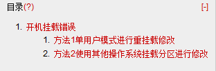
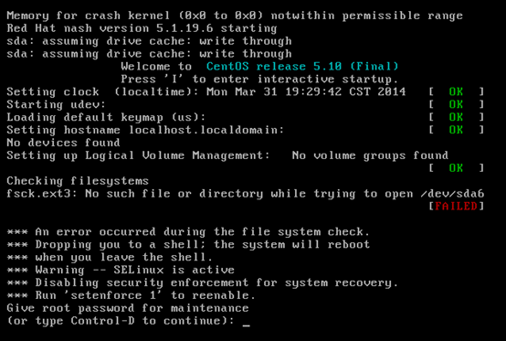
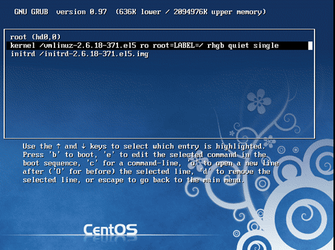
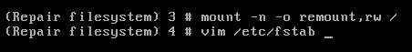
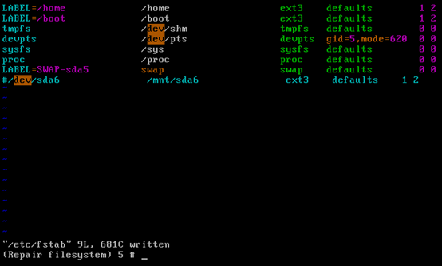
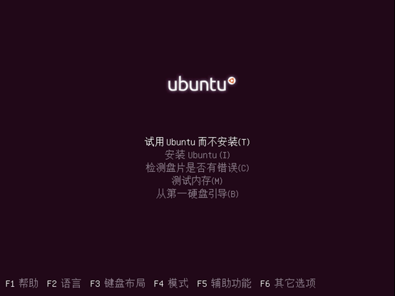
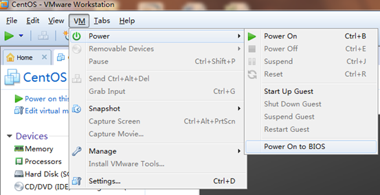
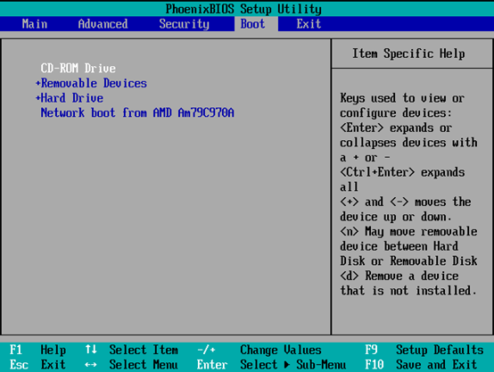
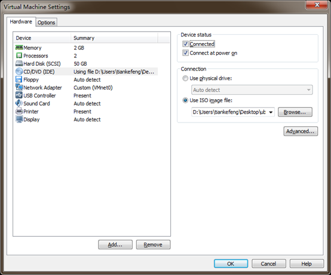

# Linux 学习记录--开机挂载错误



# 开机挂载错误

我们可以在/etc/fstab 设置开启挂载，不过如果在/etc/fstab 定义了挂载信息可是实际并不存在此分区，开机进行分区挂载时就会产生错误，导致我们不能进入操作系统，如下图  

  

根源在于 /etc/fstab中/dev/sda6分区并不存在，只需要将这行去掉即可  

```
LABEL=/                 /                       ext3    defaults        1 1
LABEL=/home             /home                   ext3    defaults        1 2
LABEL=/boot             /boot                   ext3    defaults        1 2
tmpfs                   /dev/shm                tmpfs   defaults        0 0
devpts                  /dev/pts                devpts  gid=5,mode=620  0 0
sysfs                   /sys                    sysfs   defaults        0 0
proc                    /proc                   proc    defaults        0 0
LABEL=SWAP-sda5         swap                    swap    defaults        0 0
/dev/sda6               /mnt/sda6               ext3    defaults    1 2
```

可是/etc/fstab 是只读文件，正确情况下不能修改，所以需要些特殊操作  

## 方法1：单用户模式进行重挂载修改  

**步骤1.设置 menu.lst 开机信息。指定为单用户**  



**步骤2：设置重新挂载，解决只读问题**   



**步骤3:修改文件并重新启动即可**  



## 方法2：使用其他操作系统挂载分区进行修改  

Ubantu 光盘可以不需要安装而进行使用，应用此特点，我们可以将修需要修改的文件所在分区挂载到这个系统下进行修改。
（我是在虚拟机实验，PC 效果是一样的）  



**步骤1：设置 BIOS 进行开启光盘启动**  





添加镜像文件，并设置通电时进行连接（PC 下不需要，这是模拟光驱）  



**步骤2: 试用 Ubantu**  
**步骤3: 挂载与修改问题文件**  

```
root@ubuntu:~# fdisk -l

   Device Boot      Start         End      Blocks   Id  System
/dev/sda1   *          63      208844      104391   83  Linux
/dev/sda2          208845    20691719    10241437+  83  Linux
/dev/sda3        20691720    30925124     5116702+  83  Linux
/dev/sda4        30925125    41929649     5502262+   5  Extended
/dev/sda5        30925188    32965379     1020096   82  Linux swap / Solaris

root@ubuntu:~# mount /dev/sda2 /mnt
root@ubuntu:~# df 
Filesystem     1K-blocks    Used Available Use% Mounted on
…….
/dev/sda2        9920624 4275888   5132668  46% /mnt
root@ubuntu:~# vim /mnt/etc/fstab 
root@ubuntu:~# umount /dev/sda2
```

本文出自 “StarFlex” 博客，请务必保留此出处[http://tiankefeng.blog.51cto.com/8687281/1372503](http://tiankefeng.blog.51cto.com/8687281/1372503)