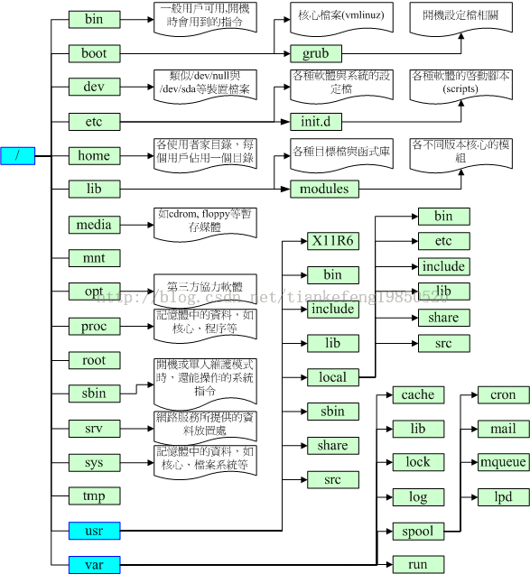

# Linux 学习记录--目录配置 FHS

# 目录配置 FHS

随着 Linux 开发产品或 distributions 越来越多，如果每个人都按照自己的想法配置目录结构放置配置文件，那么就会造成很多管理的困扰，基于此后来 FHS(filesystem hierarchy standary)标准出现了，其主要目的是希望用户可以了解到已按照软件通常放置于那个目录下

  
&nbsp;
  <table cellpadding="0" cellspacing="0" border="1">  <tbody>  <tr>  <td valign="top">  
&nbsp;
  </td>  <td valign="top">  
可分享
  </td>  <td valign="top">  
不可分享
  </td>  </tr>  <tr>  <td rowspan="2" valign="top">  
不变的
  </td>  <td valign="top">  
/usr(软件放置处)
  </td>  <td valign="top">  
/etc(配置文件)
  </td>  </tr>  <tr>  <td valign="top">  
/opt(第三方软件)
  </td>  <td valign="top">  
/boot(开机与内核相关)
  </td>  </tr>  <tr>  <td rowspan="2" valign="top">  
可变的
  </td>  <td valign="top">  
/var/mail
  </td>  <td valign="top">  
/var/run(程序相关)
  </td>  </tr>  <tr>  <td valign="top">  
/var/spool/news
  </td>  <td valign="top">  
/var/lock(程序相关)
  </td>  </tr>  </tbody>  </table>  
&nbsp;
 

其中不变的内容不因 Linux distributions 不同而改变其目录结构   
可分享内容在网络上可分享给其他系统挂载使用

<table cellpadding="0" border="1">  <tbody>  <tr>  <td>  
目录
  </td>  <td>  
应放置的文件内容
  </td>  </tr>  <tr>  <td>  
/
  </td>  <td>  
根目录 root(/)，一般建议在根目录下只有目录，不要直接有文件。根目录 是启动时系统第一个载入的分区，所以所有启动过程中会用到的文件都应该放在这个分区中。举例来说，/etc、/bin、/dev、/lib、/sbin 这 5个子目录都应该与根目录连在一起，不可独立成为某个分区。
  </td>  </tr>  <tr>  <td>  
/bin,/usr/bin,   /usr/local/bin
  </td>  <td>  
放置用户可执行的二进制文件的目录。
  </td>  </tr>  <tr>  <td>  
/boot
  </td>  <td>  
放置 Linux 系统启动时用到的文件。启动会用到 Linux 的核心文件。这个目录下面的文件 vmlinuz 就是 Linux 的核心。这一点非常重要，如果引导程序（loader）选择 grub，那么这个目录内还有/boot/grub 子目录。
  </td>  </tr>  <tr>  <td>  
/dev
  </td>  <td>  
在 Linux 系统上，任何设备都以文件类型存放在这个目录中，例如键盘、鼠 标、硬盘、光盘等。在此目录下的文件会多出两个属性，分别是主设备号(major device number)与辅设备号(minor device number)。系统核心就是通过这两个号码来判断设备的。重要的文件有/dev/null、/dev/tty[1-6]、/dev/ttyS*、 /dev/lp*、/dev/hd*、/dev/sd*等。
  </td>  </tr>  <tr>  <td>  
/etc
  </td>  <td>  
系统主要的设置文件几乎都放在这个目录内，例如人员的账号密码文件、各种服务 的起始文件等。一般来说，这个目录下的各文件属性是可以让一般用户查看的，但只有 root 有权修改。在此目录下的文件几乎都是 ASII 的纯文本文件。不 过，FHS 建议不要在这个目录中放置可执行文件。比较重要的文件有：/etc/inittab、/etc/init.d、/etc /modprobe.conf、/etc/X11、/etc/fstab、/etc/sysconfig 等。
  </td>  </tr>  <tr>  <td>  
/home
  </td>  <td>  
这是系统默认的家目录(home directory)。
  </td>  </tr>  <tr>  <td>  
/lib,/usr/lib,   /usr/local/lib
  </td>  <td>  
系统使用的函数库的目录。程序在运行过程中，可能会调用一些额外的参数，这需要函数库的协助。这些函数库就放在此处。比较重要的是/lib/modules 目录内有核心的相关模块。
  </td>  </tr>  <tr>  <td>  
/lost+found
  </td>  <td>  
系统出现异常，产生错误时，会将一些遗失的片段放于此目录下，通常这个目录会自动出现在某个分区顶层的目录下。
  </td>  </tr>  <tr>  <td>  
/mnt/media
  </td>  <td>  
这是软盘与光盘的默认载入点。通常软盘挂在/mnt/floppy 下，光盘挂在/mnt/cdrom 下。
  </td>  </tr>  <tr>  <td>  
/opt
  </td>  <td>  
这是给主机额外安装软件所放的目录。举例来说，FC4使用 Fedora 团队开发的软件，如果想要自行安装新的 KDE 桌面软件，可以将该软件安装在这个目录下。不过，以前的 Linux 系统中，我们还是习惯放在/usr/local 目录下。
  </td>  </tr>  <tr>  <td>  
/proc
  </td>  <td>  
这个目录本身是一个“虚拟文件系统”，它放置的数据都在内存中，例如系统核 心、外部设备的状态及网络状态等。因为这个目录下的数据都在内存中，所以本身不占任何硬盘空间。比较重要的文件有/proc/cpuinfo、/proc /dma、/proc/interrupts、/proc/ioports、/proc/net/*等。
  </td>  </tr>  <tr>  <td>  
/root
  </td>  <td>  
系统管理员(root)的家目录。之所以放在这里，是因为系统第一个启动就载入的分区为/，而我们希望/root 能够与/放在同一块分区上。
  </td>  </tr>  <tr>  <td>  
/sbin,/usr/sbin,   /usr/local/sbin
  </td>  <td>  
放一些系统管理员才会用到的可执行命令，例如：fdisk、mke2fs、fsck、mkswap、mount 等。与/bin 不太一样的地方是，这几个目录是给 root 系统管理用的。但目录下的执行文件可以让一般用户用来“查看”而不能设置。
  </td>  </tr>  <tr>  <td>  
/srv
  </td>  <td>  
一些服务启动之后，这些服务所需要访问的数据目录。举例来说，WWW 服务器需要的网页数据就可以放在/srv/www 中。
  </td>  </tr>  <tr>  <td>  
/tmp
  </td>  <td>  
这是让一般用户或者是正在执行的程序临时放置文件的地方。这个目录是任何人都能访问的，所以需要定期清理。当然，重要数据不可放在此目录中。
  </td>  </tr>  <tr>  <td>  
/usr
  </td>  <td>  
根据 FHS 规范的第二层内容，在/usr 目录下，包含系统的主要程序、图形界面 所需要的文件、额外的函数库、本机自行安装的软件，以及共享的目录与文件。它有点像 Windows 操作系统中的“Program files”与“Windows”这两个目录的结合。在此目录下的重要子目录有：
  <ul type="disc">  <li>/usr/bin,/usr/sbin：一般身份用户与系统管理员可执行文件放置目录</li><li>/usr/include：c/c++等程序语言的文件头（header）与包含文件（include）放置处，当以tarball 方式（*.tar.gz 的方式安装软件）安装某些数据时，会使用到里面的许多包含文件。</li><li>/usr/lib：各种应用软件的函数库文件放置目录。</li><li>/usr/local：本机自行安装的软件默认放置的目录。当前也适用于 /opt 目录。在安装完 Linux 之后，基本上所有的配置都有了，但软件总是可以升级的，例如要升级代理服务，则通常软件默认的安装地方就是/usr /local中。当安装完之后所得到的执行文件，为了与系统原执行文件区分，升级后的执行文件通常放在/usr/local/bin中。建议将后来才安装 的软件放在这里，便于管理。</li><li>/usr/share：共享文件放置的目录，例如/usr/share/doc 目录放置一些系统帮助文件、/usr/share/man 放置 manpage 文件。</li><li>/usr/src：Linux 系统相关的程序代码放置目录，例如/usr/src/linux 为核心源码。</li><li>/usr/X11R6：系统内的 X Window System 所需的执行文件几乎都放在这里。</li></ul>  </td>  </tr>  <tr>  <td>  
/var
  </td>  <td>  
这个目录也很重要，也是 FHS 规范的第二层目录内容。它主要放置系统执行过程中 经常变化的文件，例如缓存（cache）或者是随时更改的日志文件（log file）。此外，某些软件执行过程中会写入的数据库文件，例如 MySQL 数据库，也都写入这个目录中。它下面的主要目录有：
  <ul type="disc">  <li>/var/cache：程序文件在运行过程中的一些暂存盘。</li><li>/var/lib：程序执行的过程中，使用的数据文件放置的目录。例如 locate 数据库与 MySQL 及 rpm 等数据库系统，都写在这个目录中。</li><li>/var/log：登录文件放置的目录，很重要。例如/var/log/messages 就是总管所有登录文件的文件。</li><li>/var/lock：某些设备具有一次性写入的特性，例如 tab（磁带机），此时，为了避免被其他人干扰正在运行的操作，会将该设备 lock（锁）起来，以确定该设备只能被单一程序所用。</li><li>/var/run：某些程序或者是服务启动后，会将它们的 PID 放在这个目录下。</li><li>/var/spool：是一些队列数据存放的地方。例如主机收到电子邮件后，就会放到/var/spool/mail 中，若信件暂时发不出去，就会放到/var/spool/mqueue 目录下，用户工作任务分配（cron）则是放在/var/spool/cron 中。</li></ul>  </td>  </tr>  </tbody>  </table>

目录树以图标的方法来显示(图片摘自鸟哥的私房菜)

本文出自 “StarFlex” 博客，请务必保留此出处[http://tiankefeng.blog.51cto.com/8687281/1372503](http://tiankefeng.blog.51cto.com/8687281/1372503)
