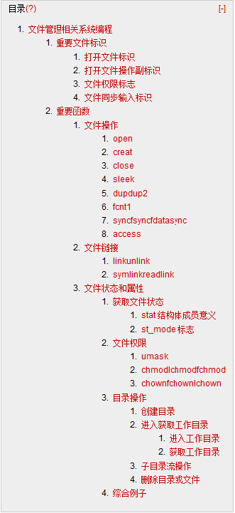

# Linux 学习记录--文件管理相关系统编程



# 文件管理相关系统编程

## 重要文件标识

### 打开文件标识
O_RDONLY：只读方式打开  
O_WRONLY：只写方式打开  
O_RDWR：可读写方式打开  

### 打开文件操作副标识
O_CREAT：若路径中文件不存在则创建,使用 Open 函数时需同时指定文件权限  
O_EXCL：若与 O_CREAT 连用，检查文件是否已经存在，若不存在则建立文件存在则返回错误，这使创建和测试成为一个原子操作  
O_APPEND：读写文件从文件尾部开始移动，所有写入数据都加入文件尾部  
O_TRUNC：若文件存在并且可以写入，此标识会将源文件内容清空  
O_NONBLOCK:如果打开或创建文件是管道文件，或一个块特殊文件，一个字符特殊文件，该表示代表后续操作非阻塞  

### 文件权限标志
S_IRUSR：用户读权限  
S_IWUSR:用户写权限  
S_IXUSR：用户执行权限  
S_IRWX：用户读写执行权限  
S_IRGRP：用户组读权限  
S_IWGRP：用户组写权限  
S_IXGRP：用户组执行权限  
S_IRWXG：用户组读写执行权限  
S_IROTH:其他用户读权限  
S_IWOTH:其他用户写权限  
S_IXOTH:其他用户执行权限  
S_IRWXO:其他用户读写执行权限  
S_ISUID：SUID 权限  
S_ISGID：SGID 权限  

### 文件同步输入标识  
O_SYNC:每次 write 都等到物理 I/O 完成才返回，包括文件属性更新 I/O 操作完成  
O_DSYNC: 每次 write 都等到物理 I/O 完成才返回，不包括文件属性更新 I/O 操作完成    
O_RSYNC:使每一个以文件描述符作为参数的 read 的参数等待，直到任何对文件同一部分进行的写操作都完成  

## 重要函数

### 文件操作
**open**  

**用于打开或创建文件**  
**Int open(文件路径，标识，权限标识)**  
**文件路径：**绝对路径与相对路径均可  
**标识：**文件标识与操作副标识以及文件同步标识的结合结合  
**权限标识：**是使用权限标识，也可用数字法标识  
**返回值：**成功返回文件标识符.出错返回-1  

**creat**  

**用于创建文件**  
**int creat(文件路径, 权限标识)**  
**返回值：**成功返回文件标识符.出错返回-1  
**说明：**以只写方式打开文件  

**close**  

**用于关闭文件,当一个进程终止时，内核会自动关闭它打开的所有文件**  
**int close(int fd)**  
**返回值：**成功返回0.出错返回-1  

**sleek**  

**用于设置文件偏移量**  
**off_tsleek(int fd,off_t offset,int whence)**    
**若 whence**= SEEK_SET,设置当前偏移量为距离文件开始处 offset 字节    
**若 whence**= SEEK_CUR,设置当前偏移量为距离文件当前偏移处 offset 字节（offset 可为正负）  
**若 whence**= SEEK_END,设置当前偏移量为文件长度加 offset（offset 可为正负）  

**返回值：**成功返回新的文件偏移量，失败返回-1 （对于管道文件不能设置偏移文件，因此返回-1）  

**dup|dup2**  

**复制一个现存的文件描述符**  
**Int dup(intfd)**  
**Int dup(intfd1,int fd2)**  
Fd1为复制的文件描述符源  
Fd2为复制的文件描述符目的地  
**如果 fd2文件为关闭应先关闭**  
**返回值：成功返回新的文件描述符，失败返回-1**  

**举例：**  
 
```
#include <unistd.h>
#include <fcntl.h>
#include <sys/stat.h>
#include <stdio.h>
int main() {
    int f = open("output", O_CREAT | O_TRUNC | O_RDWR, 0644);
    if (f == -1) {
        perror("文件创建失败！");
        return 0;
    }
    int newf = dup(f);
    write(f, "往文件里写输入！\n", 25);
    write(newf, "使用新的文件描述符！\n", 31);
    int oldInput = dup(STDOUT_FILENO);
    puts("使用标准输出到控制台");
    dup2(f, STDOUT_FILENO);
    puts("使用标准输出到文件");
    dup2(oldInput, STDOUT_FILENO);
    puts("还原标准输出到控制台");
    return 0;
}
```

**控制台输出：**  
使用标准输出到控制台  
还原标准输出到控制台  

**output 文件内容：**  
往文件里写输入！  
使用新的文件描述符！  
使用标准输出到文件  

**fcnt1**  

**改变已打开文件的文件性质**  
**int fcntl (int fd, int cmd, ...);**  

**主要功能：**  
1: 复制一个现有描述符：Cmd=F_DUPFD  
2：获取/设置文件描述符标注 cmd= F_GETFD 或 F_SETFD  
3：获取/设置文件状态标注 cmd=F_GETFL 或 F_SETFL    
4：获取/设置异步 I/O 所有权 cmd= F_GETOWN 或 F_SETOWN  
5：获取/设置记录锁 cmd= F_GETLK 或 F_SETLK   

**Fcntl 的文件状态标识**  
O_RDONLY  
O_WRONLY  
O_RDWR  
O_APPENT  
O_NONBLOCK  
O_SYNC  
O_DSYNC  
O_FSYNC  

**说明：**  
1：由于 O_RDONLY，O_WRONLY，O_RDWR 只能同时存在一个，因此需要用 O_ACCMODE 取得访问屏蔽位  
2：F_SETFL 只能设置 O_APPENT，O_NONBLOCK，O_SYNC，O_DSYNC，O_FSYNC  

**举例：**  

```
#include <stdio.h>
#include <fcntl.h>
#include <unistd.h>
int main(int argc, char *argv[]) {
    int fd = open("fcnt", O_RDWR | O_APPEND|O_SYNC );
    printf("文件描述符=%d\n", fd);
    int flag = fcntl(fd, F_GETFL, 0);
    switch (flag & O_ACCMODE) {
    case O_RDWR:
        printf("O_RDWR\n");
        break;
    case O_RDONLY:
        printf("O_RDONLY\n");
        break;
    case O_WRONLY:
        printf("O_WRONLY\n");
        break;
    default:
        printf("default\n");
        break;
    }
    if (flag & O_APPEND) {
        printf("O_APPEND\n");
    }
#if defined (O_SYNC)
    if (flag & O_SYNC) {
        printf("O_SYNC\n");
    }
#endif
    if (flag & O_NONBLOCK) {
        printf("O_NONBLOCK\n");
    }
    close(1);
    fcntl(fd,F_DUPFD,1);
    puts("通过标准输出写到文件\n");
    return 0;
}
```

**控制台输出**  
文件描述符=3  
O_RDWR  
O_APPEND  
O_SYNC  

**sync|fsync|fdatasync**  

当数据写入文件时，内核通常先将数据复制到一个缓冲区中，如果该缓冲区尚未写满，则不将其排入输出队里，直到其写满或者内核需要使用这块缓冲区做其他使用，这种方式叫做延迟写  
好处是，可以减少 IO 操作，但是带来的风险就是系统发生故障时，会造成数据的丢失  

**总结起来，数据写入文件分为以下3步：**  
1.写入缓冲区  
2.缓冲区数据排入输出队里  
3.将缓冲区数据写入磁盘  

void **sync** (void)  
将缓冲区排入输出队里后返回  

int **fsync** (int __fd);  
等待数据写入磁盘并且文件属性更新后返回  

int **fdatasync** (int __fildes);  
等待数据写入磁盘返回  

**access**  
测试实际用户是否有相应权限  
int **access** (constchar *name, int mode)  

mode:  
R_OK:测试读权限  
W_OK：测试写权限  
X_OK：测试执行权限  
F_OK：测试文件是否存在  

### 文件链接  

文件链接分为2种情况  
1.硬链接：不会产生新的 INODE,IBLOCK,只是在原有数据连接数上+1  
不能跨文件系统使用  
硬链接目录需要 ROOT 权限  

2.软链接：产生的 INODE,IBLOCK,新的 IBLOCK 记录链接的内容  
可以跨文件系统使用  

对于软链接来说，有些函数时直接作用链接文件本身，有些函数则跟随源文件链接到源文件  

<table cellpadding="0" cellspacing="0"><tbody><tr><td style="border:1px solid #000000;padding:0px 7px;" valign="top" width="189"><p><span style="font-family:'宋体';">函数</span></p></td><td style="border-width:1px 1px 1px medium;border-style:solid solid solid none;border-color:#000000 #000000 #000000;padding:0px 7px;" valign="top" width="189"><p><span style="font-family:'宋体';">不跟随符号链接</span></p></td><td style="border-width:1px 1px 1px medium;border-style:solid solid solid none;border-color:#000000 #000000 #000000;padding:0px 7px;" valign="top" width="189"><p><span style="font-family:'宋体';">跟随符号链接</span></p></td></tr><tr><td style="border-right:1px solid #000000;border-width:medium 1px 1px;border-style:none solid solid;border-color:#000000 #000000;padding:0px 7px;" valign="top" width="189"><p>access</p></td><td style="border-width:medium 1px 1px medium;border-style:none solid solid none;border-color:#000000 #000000;padding:0px 7px;" valign="top" width="189"><br></td><td style="border-width:medium 1px 1px medium;border-style:none solid solid none;border-color:#000000 #000000;padding:0px 7px;" valign="top" width="189"><p><span style="font-family:'宋体';">√</span></p></td></tr><tr><td style="border-right:1px solid #000000;border-width:medium 1px 1px;border-style:none solid solid;border-color:#000000 #000000;padding:0px 7px;" valign="top" width="189"><p>chdir</p></td><td style="border-width:medium 1px 1px medium;border-style:none solid solid none;border-color:#000000 #000000;padding:0px 7px;" valign="top" width="189"><br></td><td style="border-width:medium 1px 1px medium;border-style:none solid solid none;border-color:#000000 #000000;padding:0px 7px;" valign="top" width="189"><p><span style="font-family:'宋体';">√</span></p></td></tr><tr><td style="border-right:1px solid #000000;border-width:medium 1px 1px;border-style:none solid solid;border-color:#000000 #000000;padding:0px 7px;" valign="top" width="189"><p>chmod</p></td><td style="border-width:medium 1px 1px medium;border-style:none solid solid none;border-color:#000000 #000000;padding:0px 7px;" valign="top" width="189"><br></td><td style="border-width:medium 1px 1px medium;border-style:none solid solid none;border-color:#000000 #000000;padding:0px 7px;" valign="top" width="189"><p><span style="font-family:'宋体';">√</span></p></td></tr><tr><td style="border-right:1px solid #000000;border-width:medium 1px 1px;border-style:none solid solid;border-color:#000000 #000000;padding:0px 7px;" valign="top" width="189"><p>chown</p></td><td style="border-width:medium 1px 1px medium;border-style:none solid solid none;border-color:#000000 #000000;padding:0px 7px;" valign="top" width="189"><p><span style="font-family:'宋体';">√</span></p></td><td style="border-width:medium 1px 1px medium;border-style:none solid solid none;border-color:#000000 #000000;padding:0px 7px;" valign="top" width="189"><p><span style="font-family:'宋体';">√</span></p></td></tr><tr><td style="border-right:1px solid #000000;border-width:medium 1px 1px;border-style:none solid solid;border-color:#000000 #000000;padding:0px 7px;" valign="top" width="189"><p>creat</p></td><td style="border-width:medium 1px 1px medium;border-style:none solid solid none;border-color:#000000 #000000;padding:0px 7px;" valign="top" width="189"><br></td><td style="border-width:medium 1px 1px medium;border-style:none solid solid none;border-color:#000000 #000000;padding:0px 7px;" valign="top" width="189"><p><span style="font-family:'宋体';">√</span></p></td></tr><tr><td style="border-right:1px solid #000000;border-width:medium 1px 1px;border-style:none solid solid;border-color:#000000 #000000;padding:0px 7px;" valign="top" width="189"><p>exec</p></td><td style="border-width:medium 1px 1px medium;border-style:none solid solid none;border-color:#000000 #000000;padding:0px 7px;" valign="top" width="189"><br></td><td style="border-width:medium 1px 1px medium;border-style:none solid solid none;border-color:#000000 #000000;padding:0px 7px;" valign="top" width="189"><p><span style="font-family:'宋体';">√</span></p></td></tr><tr><td style="border-right:1px solid #000000;border-width:medium 1px 1px;border-style:none solid solid;border-color:#000000 #000000;padding:0px 7px;" valign="top" width="189"><p>lchown</p></td><td style="border-width:medium 1px 1px medium;border-style:none solid solid none;border-color:#000000 #000000;padding:0px 7px;" valign="top" width="189"><p><span style="font-family:'宋体';">√</span></p></td><td style="border-width:medium 1px 1px medium;border-style:none solid solid none;border-color:#000000 #000000;padding:0px 7px;" valign="top" width="189"><br></td></tr><tr><td style="border-right:1px solid #000000;border-width:medium 1px 1px;border-style:none solid solid;border-color:#000000 #000000;padding:0px 7px;" valign="top" width="189"><p>link</p></td><td style="border-width:medium 1px 1px medium;border-style:none solid solid none;border-color:#000000 #000000;padding:0px 7px;" valign="top" width="189"><br></td><td style="border-width:medium 1px 1px medium;border-style:none solid solid none;border-color:#000000 #000000;padding:0px 7px;" valign="top" width="189"><p><span style="font-family:'宋体';">√</span></p></td></tr><tr><td style="border-right:1px solid #000000;border-width:medium 1px 1px;border-style:none solid solid;border-color:#000000 #000000;padding:0px 7px;" valign="top" width="189"><p>lstat</p></td><td style="border-width:medium 1px 1px medium;border-style:none solid solid none;border-color:#000000 #000000;padding:0px 7px;" valign="top" width="189"><p><span style="font-family:'宋体';">√</span></p></td><td style="border-width:medium 1px 1px medium;border-style:none solid solid none;border-color:#000000 #000000;padding:0px 7px;" valign="top" width="189"><br></td></tr><tr><td style="border-right:1px solid #000000;border-width:medium 1px 1px;border-style:none solid solid;border-color:#000000 #000000;padding:0px 7px;" valign="top" width="189"><p>open</p></td><td style="border-width:medium 1px 1px medium;border-style:none solid solid none;border-color:#000000 #000000;padding:0px 7px;" valign="top" width="189"><br></td><td style="border-width:medium 1px 1px medium;border-style:none solid solid none;border-color:#000000 #000000;padding:0px 7px;" valign="top" width="189"><p><span style="font-family:'宋体';">√</span></p></td></tr><tr><td style="border-right:1px solid #000000;border-width:medium 1px 1px;border-style:none solid solid;border-color:#000000 #000000;padding:0px 7px;" valign="top" width="189"><p>opendir</p></td><td style="border-width:medium 1px 1px medium;border-style:none solid solid none;border-color:#000000 #000000;padding:0px 7px;" valign="top" width="189"><br></td><td style="border-width:medium 1px 1px medium;border-style:none solid solid none;border-color:#000000 #000000;padding:0px 7px;" valign="top" width="189"><p><span style="font-family:'宋体';">√</span></p></td></tr><tr><td style="border-right:1px solid #000000;border-width:medium 1px 1px;border-style:none solid solid;border-color:#000000 #000000;padding:0px 7px;" valign="top" width="189"><p>pathconf</p></td><td style="border-width:medium 1px 1px medium;border-style:none solid solid none;border-color:#000000 #000000;padding:0px 7px;" valign="top" width="189"><br></td><td style="border-width:medium 1px 1px medium;border-style:none solid solid none;border-color:#000000 #000000;padding:0px 7px;" valign="top" width="189"><p><span style="font-family:'宋体';">√</span></p></td></tr><tr><td style="border-right:1px solid #000000;border-width:medium 1px 1px;border-style:none solid solid;border-color:#000000 #000000;padding:0px 7px;" valign="top" width="189"><p>readlink</p></td><td style="border-width:medium 1px 1px medium;border-style:none solid solid none;border-color:#000000 #000000;padding:0px 7px;" valign="top" width="189"><p><span style="font-family:'宋体';">√</span></p></td><td style="border-width:medium 1px 1px medium;border-style:none solid solid none;border-color:#000000 #000000;padding:0px 7px;" valign="top" width="189"><br></td></tr><tr><td style="border-right:1px solid #000000;border-width:medium 1px 1px;border-style:none solid solid;border-color:#000000 #000000;padding:0px 7px;" valign="top" width="189"><p>remove</p></td><td style="border-width:medium 1px 1px medium;border-style:none solid solid none;border-color:#000000 #000000;padding:0px 7px;" valign="top" width="189"><p><span style="font-family:'宋体';">√</span></p></td><td style="border-width:medium 1px 1px medium;border-style:none solid solid none;border-color:#000000 #000000;padding:0px 7px;" valign="top" width="189"><br></td></tr><tr><td style="border-right:1px solid #000000;border-width:medium 1px 1px;border-style:none solid solid;border-color:#000000 #000000;padding:0px 7px;" valign="top" width="189"><p>rename</p></td><td style="border-width:medium 1px 1px medium;border-style:none solid solid none;border-color:#000000 #000000;padding:0px 7px;" valign="top" width="189"><p><span style="font-family:'宋体';">√</span></p></td><td style="border-width:medium 1px 1px medium;border-style:none solid solid none;border-color:#000000 #000000;padding:0px 7px;" valign="top" width="189"><br></td></tr><tr><td style="border-right:1px solid #000000;border-width:medium 1px 1px;border-style:none solid solid;border-color:#000000 #000000;padding:0px 7px;" valign="top" width="189"><p>stat</p></td><td style="border-width:medium 1px 1px medium;border-style:none solid solid none;border-color:#000000 #000000;padding:0px 7px;" valign="top" width="189"><br></td><td style="border-width:medium 1px 1px medium;border-style:none solid solid none;border-color:#000000 #000000;padding:0px 7px;" valign="top" width="189"><p><span style="font-family:'宋体';">√</span></p></td></tr><tr><td style="border-right:1px solid #000000;border-width:medium 1px 1px;border-style:none solid solid;border-color:#000000 #000000;padding:0px 7px;" valign="top" width="189"><p>truncate</p></td><td style="border-width:medium 1px 1px medium;border-style:none solid solid none;border-color:#000000 #000000;padding:0px 7px;" valign="top" width="189"><br></td><td style="border-width:medium 1px 1px medium;border-style:none solid solid none;border-color:#000000 #000000;padding:0px 7px;" valign="top" width="189"><p><span style="font-family:'宋体';">√</span></p></td></tr><tr><td style="border-right:1px solid #000000;border-width:medium 1px 1px;border-style:none solid solid;border-color:#000000 #000000;padding:0px 7px;" valign="top" width="189"><p>unlink</p></td><td style="border-width:medium 1px 1px medium;border-style:none solid solid none;border-color:#000000 #000000;padding:0px 7px;" valign="top" width="189"><p><span style="font-family:'宋体';">√</span></p></td><td style="border-width:medium 1px 1px medium;border-style:none solid solid none;border-color:#000000 #000000;padding:0px 7px;" valign="top" width="189"><br></td></tr></tbody></table>

**link|unlink**  
**创建文件的硬链接**  
int **link** (constchar *__from, constchar *__to)  

**删除一个文件**  
int **unlink** (constchar *__name)  

**说明：**对于硬链接来说 unlink 只是删除文件链接符，文件实际数据的连接数-1，如果为文件实际数据0则在所有进程关闭对此文件连接时删除  

举例  

```
#include <unistd.h>
#include <stdio.h>
#include <fcntl.h>
#define BUFFER_SIZE 409600
int printfilestat(int fd, struct stat *buf) {
    int results = fstat(fd, buf);
    if (results == -1) {
        perror("文件属性获取失败");
        return -1;
    }
    printf("文件连接数是=%d\n", buf->st_nlink);
    return 0;
}
int main() {
    int fd = open("linkfile",  O_RDWR, 0777);
    if (fd == -1) {
        perror("文件打开失败");
        return -1;
    }
    struct stat buf;
    printfilestat(fd, &buf);
    if (link("linkfile", "newlinkfile") == 0) {
        puts("链接文件创建成功");
    }
    printfilestat(fd, &buf);
    if (unlink("newlinkfile") == 0) {
        puts("newlinkfile文件删除成功");
    }
    printfilestat(fd, &buf);
    if (unlink("linkfile") == 0) {
        puts("linkfile文件删除成功");
    }
    printfilestat(fd, &buf);
    sleep(30);
    close(fd);
    puts("关闭文件！");
    sleep(-1);
    return 0;
}
```

**控制台输出**  
文件连接数是=1  
链接文件创建成功  
文件连接数是=2  
newlinkfile 文件删除成功  
文件连接数是=1  
linkfile 文件删除成功  
文件连接数是=0  
 
虽然文件连接数为0 但是文件数据没有被删除，需要等待所有进程都 close 该文件才会被从磁盘删除  


tkf@tkf:~/workspace/FileOperator$ ll linkfile ;df ./  
-rwxrwxr-x 1 tkf tkf 4096005月9 16:34linkfile*  
文件系统1K-blocks已用可用已用% 挂载点  
/dev/sda128768380 17972780931121266% /  
执行程序  
  
tkf@tkf:~/workspace/FileOperator$ df ./  
文件系统1 K-blocks 已用可用已用% 挂载点    
/dev/sda128768380 17972784931120866% /   
linkfile, newlinkfile 文件符号连接删除，因此可用资源变多了  

sleep(30)  
tkf@tkf:~/workspace/FileOperator$df ./  
文件系统1 K-blocks 已用可用已用% 挂载点  
/dev/sda128768380 17972344931164866% /  
执行了 close,因此在无进程来接到数据，所以文件数据被释放，可用资源再一次变多了   

**symlink|readlink**  
 
**创建一个软链接**  
int **symlink** (constchar *__from, constchar *__to)  
返回值：成功返回0，失败返回-1  

**打开软链接文件**  
ssize_t **readlink** (constchar *__restrict __path,  
char *__restrict __buf, size_t __len)  
**返回值：**成功返回0，失败返回-1  
 
### 文件状态和属性  

**获取文件状态**  
**Int fstat(文件标识符，struct stat *buf)**  
**Int lstat(文件路径，struct stat *buf)**  
**Int stat(文件路径，struct stat *buf)**  

**文件路径：**绝对路径与相对路径均可  
**文件标识符：**文件创建或打开时返回的文件标示符  
**struct stat *buf：**文件属性结构体  

**返回值：成功返回0，失败返回-1**  

**说明：stat 和 lstat 的区别：当文件是一个符号链接时，lstat 返回的是该符号链接本身的信息；而 stat 返回的是该链接指向的文件的信息**  
 
## stat 结构体成员意义  
struct stat {  
 dev_t       st_dev;  文件所在设备的 ID  
ino_t       st_ino;   与该文件关联的 inode  
mode_t      st_mode;    
 nlink_t     st_nlink;   /* 链向此文件的连接数(硬连接)*/  
uid_t       st_uid;  文件属主的 UID 号    
gid_t       st_gid;    文件属主的 GID 号  
dev_t       st_rdev;    设备号，针对设备文件  
 off_t       st_size;    文件大小  
 blksize_t   st_blksize; 系统块的大小(IO 缓冲区适合大小)  
 blkcnt_t    st_blocks; 文件所占块数  
time_t      st_atime;  
time_t      st_mtime;    
time_t      st_ctime;    
}  

## st_mode 标志  

**文件类型标志：**  
S_IFBLK：文件是一个特殊的块设备  
S_IFDIR：文件是一个目录  
S_IFCHR：文件是一个特殊的字符设备  
S_IFIFO：文件是一个 FIFO 设备  
S_IFREG：文件是一个普通文件（REG 即使 regular 啦）  
S_IFLNK：文件是一个符号链接  
**其他模式标志：**   
S_ISUID: 文件设置了 SUID 位  
S_ISGID：文件设置了 SGID 位  
S_ISVTX：文件设置了 SBIT 位  
**用于解释 st_mode 标志的掩码：**  
S_IFMT：文件类型  
S_IRWXU：属主的读/写/执行权限，可以分成 S_IXUSR,S_IRUSR, S_IWUSR  
S_IRWXG：属组的读/写/执行权限，可以分成 S_IXGRP,S_IRGRP, S_IWGRP  
S_IRWXO：其他用户的读/写/执行权限，可以分为 S_IXOTH,S_IROTH, S_IWOTH  
**确定文件类型**  
S_ISBLK：测试是否是特殊的块设备文件  
S_ISCHR：测试是否是特殊的字符设备文件  
S_ISDIR：测试是否是目录（我估计 find .-type d 的源代码实现中就用到了这个宏）  
S_ISFIFO：测试是否是 FIFO 设备    
S_ISREG：测试是否是普通文件  
S_ISLNK：测试是否是符号链接  
S_ISSOCK：测试是否是 socket  

## 文件权限  

**umask**  

**设置文件权限屏蔽字**  
mode_t **umask** (mode_t __mask)  

**chmod|lchmod|fchmod**  

**设置文件权限**  
int **chmod** (constchar * file, __mode_tmode)  
int **lchmod** (constchar * file, __mode_tmode)  
int **fchmod** (int fd, mode_tmode)  
   

**chown|fchown|lchown**  

**设置文件所属用户及用户组**  
int **chown** (constchar *__file, __uid_t __owner, __gid_t__group)  
int **fchown** (int __fd, __uid_t __owner, __gid_t __group) _  
int **lchown** (constchar *__file, __uid_t __owner, __gid_t __group)  

## 目录操作  

### 创建目录  
**Int mkdir(路径，权限)**  
**路径:**绝对路径相对路径均可  
**权限:**以数字形式表示的权限  
**返回值：**成功返回0，失败返回-1  

### 进入|获取工作目录  

**进入工作目录**  
**Int chdir(路径)**  
**路径:**绝对路径相对路径均可  
**返回值：**成功返回0，失败返回-1   

**Int fchdir(intfiledes)**  
**返回值：**成功返回0，失败返回-1  

**获取工作目录**  
char *getcwd (char *__buf, size_t __size)  
**返回值：**当前工作目录  

**子目录流操作**  

**打开目录，获得子目录流指针**  
**DIR*opendir(char *name)**  

**读取子目录**  
**structdirent* readdir((DIR *dirp)**  

**返回子目录流里的当前位置**  
**longint telldir(DIR* drip)**  

**设置子目录流的当前数据项指针**  
**voidseekdir(DIR* drip,long int loc)**  

**关闭子目录流**  
**DIR*opendir(DIR* drip)**  

**删除目录或文件**  

**删除目录：int rmdir(路径)**  
**删除文件：int unlink(路径)**  

**返回值：成功返回1，失败返回-1**  
# 综合例子  

```
#include<fcntl.h>
#include<sys/stat.h>
#include<unistd.h>
#include<stdio.h>
#include<malloc.h>
#include<string.h>
#include<dirent.h>
#include<stdlib.h>
typedefenum {
    false = 0, true = 1
} bool;
voidprintFileInfo(struct stat* buf) {
    bool userall = false;
    printf("文件权限是:%o. 详细信息如下：\n", (buf->st_mode& 0x0fff));
    if (buf->st_mode& S_IRWXU) {
        userall = true;
        printf("所有者拥有读写执行权限\n");
    }
    if (buf->st_mode& S_IRWXG) {
        printf("用户组拥有读写执行权限\n");
    }
    if (buf->st_mode& S_IRWXO) {
        printf("其他人拥有读写执行权限\n");
    }
    if (userall) {
        if (buf->st_mode& S_IRUSR) {
            printf("所有者拥有读权限\n");
        }
        if (buf->st_mode& S_IWUSR) {
            printf("所有者拥有写权限\n");
        }
    }
    if (buf->st_mode& S_IFREG) {
        printf("文件是一个普通文件\n");
    }
    if (buf->st_mode& S_ISUID) {
        printf("文件设置了 SUID 权限\n");
    }
    if (buf->st_mode& S_ISGID) {
        printf("文件设置了 GUID 权限\n");
    }
    printf("UID=%d\n", buf->st_uid);
    printf("GID=%d\n", buf->st_gid);
    printf("占用block=%ld\n", buf->st_blocks);
    printf("block大小=%ld\n", buf->st_blksize);
    printf("最后访问时间=%ld\n", buf->st_atim.tv_sec);
    printf("最后状态更新时间=%ld\n", buf->st_ctim.tv_sec);
    printf("最后修改时间=%ld\n", buf->st_mtim.tv_sec);
}
intOpenFile(constchar *fpath) {
    unlink(fpath);
    int f = open(fpath, O_RDWR);
    if (f == -1) {
        f = creat(fpath, S_IWUSR | S_IRUSR);
        if (f != -1) {
            printf("创建一个文件\n");
        } else {
            printf("无法创建文件\n");
            return -1;
        }
    } else {
        printf("文件打开成功\n");
    }
    return f;
}
voidscan_dir(constchar* dir, int depth) {
    DIR *dp;
    struct dirent* entry;
    if ((dp = opendir(dir)) == NULL) {
        printf("无法打开目录:%s\n", dir);
        return;
    }
    struct stat statbuf;
    chdir(dir);
    while ((entry = readdir(dp)) != NULL) {
        constchar* name = entry->d_name;
        lstat(name, &statbuf);
        if (S_IFDIR & statbuf.st_mode) {
            if (strcmp(".", entry->d_name) == 0
                    || strcmp("..", entry->d_name) == 0) {
                continue;
            }
            printf("%*s%s:%o\n", depth, "", entry->d_name,
                    (statbuf.st_mode& 0x0fff));
            scan_dir(entry->d_name, depth + 4);
        } else {
            printf("%*s%s:%o\n", depth, "", entry->d_name,
                    (statbuf.st_mode& 0x0fff));
        }
    }
    chdir("..");
    closedir(dp);
}
intmain() {
    constchar *fpath = "test";
    int f = OpenFile(fpath);
    struct stat *buf = malloc(sizeof(struct stat));
    fstat(f, buf);
    printf("===================================================\n");
    printFileInfo(buf);
    printf("===================================================\n");
    close(f);
    sleep(1);
    chmod("test", 7777);
    printf("更改文件权限为7777\n");
    stat("test", buf);
    printf("===================================================\n");
    printFileInfo(buf);
    printf("===================================================\n");
    free(buf);
    printf("==================扫描文件夹============================\n");
    scan_dir("/home", 0);
    umask(0011);
    mkdir("/tmp/mydir", 0777);
    creat("/tmp/mydir/myfile", 0777);
    printf("==================扫描文件夹==========================\n");
    scan_dir("/tmp/mydir", 0);
    chdir("/tmp");
    unlink("mydir/myfile");
    rmdir("mydir");
    return 0;
}
```

**执行结果**  
创建一个文件  
===================================================  
文件权限是:600. 详细信息如下：  
所有者拥有读写执行权限  
所有者拥有读权限  
所有者拥有写权限  
文件是一个普通文件  
UID=0  
GID=0  
占用 block=8  
block 大小=4096  
最后访问时间=1397539372  
最后状态更新时间=1397539372  
最后修改时间=1397539372  
===================================================  
更改文件权限为7777  
===================================================  
文件权限是:7141. 详细信息如下：  
所有者拥有读写执行权限  
用户组拥有读写执行权限  
其他人拥有读写执行权限  
文件是一个普通文件  
文件设置了 SUID 权限  
文件设置了 GUID 权限  
UID=0   
GID=0   
占用 block=8  
block 大小=4096  
最后访问时间=1397539372  
最后状态更新时间=1397539373  
最后修改时间=1397539372  
===================================================  
==================扫描文件夹============================  
.bashrc:644  
.bash_logout:644  
.mozilla:755  
extensions:755  
plugins:755  
.nautilus:755   
metafiles:700  
目录创建成功  
文件创建成功    
==================扫描文件夹==========================  
myfile:766  
文件删除成功  
目录删除成功  

本文出自 “StarFlex” 博客，请务必保留此出处[http://tiankefeng.blog.51cto.com/8687281/1372503](http://tiankefeng.blog.51cto.com/8687281/1372503)  