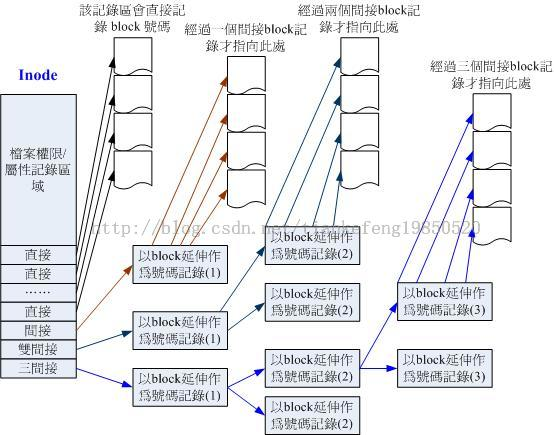

# Linux 学习记录--文件系统简介

# 文件系统简介

对于 Linux 来说正规的文件系统为 EXT2，一个文件系统存储的数据通常包括文件权限和属性，以及文件数据，这两部分分别存储在不同的地方。
 
**简单的说文件系统数据分为3部分**
**Superblock**:记录次文件系统的整体信息，包括 inode/iblock 的总量，使用量，剩余量，已经文件系统的整体信息
**Inode**:记录文件的属性，一个文件占用一个 inode,同时记录此文件数据所在的 block 号码
**Iblock**:实际记录文件的内容，若文件过大时，会占用多个 block
 
**我的理解**
文件系统由包含多个文件，每个文件都会占用1个 inode 和若干 iblock,inode 用来存储文件权限和属性.以及文件数据存放的 iblock 的编号，iblock 则存放文件的实际数据（每个 inode 和 iblock都含有一个编号）
 
对于容量很大的文件系统，EXT2格式化时会分为多个 block group,每个组队都有一个独立的/inode/block/superblock
 
## iblock (数据区块)

iblock 是用来放置文件内容数据地方，在 Ext2 文件系统中所支持的 block 大小有 1 K, 2 K 及 4 K 三种而已。
每个 block 内最多只能够放置一个文件的数据；
承上，如果文件大于 block 的大小，则一个文件会占用多个 block 数量；
承上，若文件小于 block ，则该 block 的剩余容量就不能够再被使用了(磁盘空间会浪费)。

## Inode
Inode 主要包含信息
1. 该文件的存取模式(read/write/excute)；
2. 该文件的拥有者与群组(owner/group)； 
3. 该文件的容量； 
4. 该文件创建或状态改变的时间(ctime)； 
5. 最近一次的读取时间(atime)； 
6. 最近修改的时间(mtime)； 
7. 定义文件特性的旗标(flag)，如 SetUID...； 
8. 该文件真正内容的指向(pointer)；
9. 其他信息
 
**每个 inode 大小均固定为 128 bytes**； 
每个文件都仅会占用一个 inode 而已；
承上，因此文件系统能够创建的文件数量与 inode 的数量有关；
**系统读取文件时需要先找到 inode，并分析 inode 所记录的权限与用户是否符合，若符合才能够开始实际读取 block 的内容**。 

### Inode 三级间接索引
inode 要记录的数据非常多，但偏偏又只有128 bytes 而已，为了记录更多的数据，系统很将 inode 记录 block 号码的区域定义为12个直接，一个间接, 一个双间接与一个三间接记录区。记录区。



假设 block 为1 K
 
12 个直接指向： 12*1 K=12 K
由于是直接指向，所以总共可记录 12 笔记录，因此总额大小为如上所示；
间接： 256*1 K=256 K
每笔 block 号码的记录会花去 4 bytes，因此 1 K 的大小能够记录 256 笔记录，因此一个间接可以记录的文件大小如上；
双间接： 256*256*1 K=2562 K
第一层 block 会指定 256 个第二层，每个第二层可以指定 256 个号码，因此总额大小如上；
三间接： 256*256*256*1 K=2563 K
第一层 block 会指定 256 个第二层，每个第二层可以指定 256 个第三层，每个第三层可以指定 256 个号码，因此总额大小如上；
总额：将直接、间接、双间接、三间接加总，得到 12 + 256 + 256*256 + 256*256*256 (K) = 16 GB 
 
## Superblock (超级区块)
Superblock 是记录整个 filesystem 相关信息的地方， 没有 Superblock，就没有这个 filesystem 了。他记录的信息主要有：
1.      block 与 inode 的总量； 
2.      未使用与已使用的 inode / block 数量；
block 与 inode 的大小 (block 为 1, 2, 4 K，inode 为 128 bytes)； 
filesystem 的挂载时间、最近一次写入数据的时间、最近一次检验磁盘 (fsck) 的时间等文件系统的相关信息；
一个 valid bit 数值，若此文件系统已被挂载，则 valid bit 为 0 ，若未被挂载，则 valid bit 为 1 。
### Superblock 信息查看
 
通过 dumpe2fs 命令查看文件系统的 superblock
 
**举例：观察文件系统的相关信息**

```

[root@www ~]# df   <==这个命令可以叫出目前挂载的装置
Filesystem    1K-blocks      Used Available Use% Mounted on
/dev/hdc2       9920624   3822848   5585708  41% /      
/dev/hdc3       4956316    141376   4559108   4% /home
/dev/hdc1        101086     11126     84741  12% /boot
tmpfs            371332         0    371332   0% /dev/shm

[root@www ~]# dumpe2fs /dev/hdc2
dumpe2fs 1.39 (29-May-2006)
Filesystem volume name:   /1             <==这个是文件系统的名称(Label)
Filesystem features:      has_journal ext_attr resize_inode dir_index 
 filetype needs_recovery sparse_super large_file
Default mount options:    user_xattr acl <==默认挂载的参数
Filesystem state:         clean          <==这个文件系统是没问题的(clean)
Errors behavior:          Continue
Filesystem OS type:       Linux
Inode count:              2560864        <==inode 的总数
Block count:              2560359        <==block 的总数
Free blocks:              1524760        <==还有多少个 block 可用
Free inodes:              2411225        <==还有多少个 inode 可用
First block:              0
Block size:               4096           <==每个 block 的大小啦！
Filesystem created:       Fri Sep  5 01:49:20 2008
Last mount time:          Mon Sep 22 12:09:30 2008
Last write time:          Mon Sep 22 12:09:30 2008
Last checked:             Fri Sep  5 01:49:20 2008
First inode:              11
Inode size:               128            <==每个 inode 的大小
Journal inode:            8             
Journal backup:           inode blocks
Journal size:             128M
Group 0: (Blocks 0-32767) <==第一个 data group 内容, 包含 block 的启始/结束号码
Primary superblock at 0, Group descriptors at 1-1  <==超级区块在 0 号 block
Reserved GDT blocks at 2-626
Block bitmap at 627 (+627), Inode bitmap at 628 (+628)
Inode table at 629-1641 (+629)                     <==inode table 所在的 block 0 free blocks, 32405 free inodes, 2 directories    <==所有 block 都用完了！
Free blocks:
Free inodes: 12-32416                              <==剩余未使用的 inode 号码
Group 1: (Blocks 32768-65535)
....(底下省略)....
```

## 目录与文件读取

在文件系统下创建一个文件都会分配一个 inode 和若干 iblock,目录和文件都是文件系统下的一个文件，

### 对于目录来说
inode ：记录了目录的权限，
block：记录了目录的名称，目录下包含的文件名名与文件名所占用的 inode 号码
 
### 举例：查看 Inode
[root@bogon ~]# ls -li
2366420 -rw------- 1 root root  1377 02-18 20:26 anaconda-ks.cfg
2366454 drwxr-xr-x 2 root root  4096 02-18 20:41 Desktop
2366370 -rw-r--r-- 1 root root 35014 02-1820:25 install.log
2366371 -rw-r--r-- 1 root root  6431 02-18 20:22 install.log.syslog
 
### 对于文件来说
文件名：在包含其的目录对应的 iblock 中记录
inode ：记录了文件的权限，
block：记录文件实际数据
 
 
**举例来说，如果我想要读取/etc/passwd 这个文件时，系统是如何读取的呢？**
 
[root@bogon ~]# ll -di / /etc /etc/passwd
     2 drwxr-xr-x  24 root root  4096 02-22 19:34 /
1134561 drwxr-xr-x 114 root root 1228802-22 19:36 /etc
2528506 -rw-r--r--   1 root root 2219 02-18 20:39 /etc/passwd
 
1. / 的 inode：
透过挂载点的信息找到 /dev/hdc2 的 inode 号码为 2 的根目录 inode，且 inode 规范的权限让我们可以读取该 block 的内容(有 r 与 x) ；
2. / 的 block：
经过上个步骤取得 block 的号码，并找到该内容有 etc/ 目录的 inode 号码 (1912545)；
3. etc/ 的 inode：
读取 1912545 号 inode 得知 vbird 具有 r 与 x 的权限，因此可以读取 etc/ 的 block内容；
4. etc/ 的 block：
经过上个步骤取得 block 号码，并找到该内容有 passwd 文件的 inode 号码 (1914888)；
5. passwd 的 inode：
读取 1914888 号 inode 得知 vbird 具有 r 的权限，因此可以读取 passwd 的 block 内容；
6. passwd 的 block：
最后将该 block 内容的数据读出来

本文出自 “StarFlex” 博客，请务必保留此出处[http://tiankefeng.blog.51cto.com/8687281/1372503](http://tiankefeng.blog.51cto.com/8687281/1372503)
 