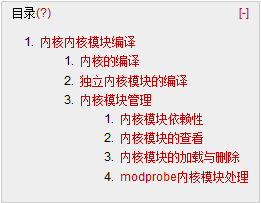
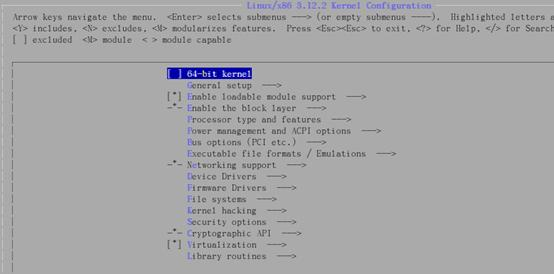
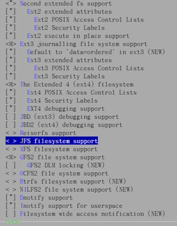

# Linux 学习记录--内核|内核模块编译  

  

# 内核|内核模块编译  
（对于内核的知识觉得了解不够，等学习完LFS再来详细整理下这方面的知识）  

**内核：**系统上面的一个文件，这个文件包含了驱动主机各项硬件的检测程序和驱动模块。  
计算机真正工作的是硬件，内核是用来控制这些硬件工作的（主要通过硬件驱动），如果我们需要硬件来完成某项工作时需要内核的帮助才能完成  
**内核模块：**编译成模块的驱动程序。既然内核中已经包括了驱动程序，那么为什么需要驱动模块呢？因为硬件发展很快，如果一有新的硬件出现，就需要重新编译内核就会很麻烦，因此将部分驱动编译成内核模块，在内核需要的时候加载，这样就既可以保证新硬件的使用，也可以保证内核不会一出现新硬件就重新编译  

对于硬件驱动程序存在以下两种处理方式  
1.      编译到内核  
2.      编译成内核模块，内核需要时候进行加载  
对于内核来说越简单越好，一些不常用的驱动可以独立成内核模块  

## 内核的编译  
1. 解压缩内核文件  
[root@localhost shared]# tar -jxvf linux-3.12.2.tar.bz2-C /usr/src/kernels/  

2. 打开内核配置菜单，开始配置内核  
[root@localhost linux-3.12.2]# make menuconfig  

  

配置项主要分为3中选择类型  
<>:不参加编译  
<*>参加编译   
<M>以内核模块形式参加编译  

  
 
3.      配置完毕后，会生成一个.config 文件保存刚才的配置信息  

```
[root@localhost linux-3.12.2]# ll -a
-rw-r--r--   1 root root 107133 04-03 15:08 .config
```

4.      清理上一次缓冲后开始编译内核  

```
[root@localhost linux-3.12.2]# make clean
[root@localhost linux-3.12.2]# make bzImage
Setup is 15704 bytes (padded to 15872 bytes).
System is 2890 kB
CRC 4dc9f3fc
Kernel: arch/x86/boot/bzImage is ready  (#1)
[root@localhost linux-3.12.2]# ll  ./arch/x86/boot/bzImage 
-rw-r--r-- 1 root root 2974816 04-03 16:15 ./arch/x86/boot/bzImage
```

5.编译在第2步选择的内核模块  

```
[root@localhost linux-3.12.2]# make modules
[root@localhost ~]# ll /lib/modules/
drwxr-xr-x 3 root root 4096 04-03 12:57 2.6.30.3
=>编译完成内核模块但未安装，所以在/lib/modules/下并未产生任何内核模块
```

6.安装内核模块，在/lib/modules/会产生对应版本的内核模块库  

```
[root@localhost ~]# make modules_install
[root@localhost linux-3.12.2]# ll /lib/modules/
drwxr-xr-x 3 root root 4096 04-03 16:54 3.12.2
=>到处为止内核与内核模块已经编译安装完毕
```

7.利用 GRUB 做一个多重引导，新的引导加载刚编好的内核  

```
[root@localhost ~]# 
cp /usr/src/kernels/linux-3.12.2/arch/x86/boot/bzImage /boot/vmlinuz-3.12.2
```

8.创建虚拟文件系统  

```
[root@localhost ~]# mkinitrd -v /boot/initrd-3.12.2.img 3.12.2
[root@localhost ~]# ll /boot/initrd-3.12.2.img /boot/vmlinuz-3.12.2 
-rw------- 1 root root 2752740 04-04 08:53 /boot/initrd-3.12.2.img
-rw-r--r-- 1 root root 2974816 04-04 08:52 /boot/vmlinuz-3.12.2
```

9.      将内核配置信息保存以便下回使用  

```
[root@localhost kernels]# cp /usr/src/kernels/linux-3.12.2/.config /boot/config-3.12.2
```

10.      编辑 menu.lst 添加新的指向新内核的引导  

```
[root@localhost ~]# vim /boot/grub/menu.lst
title CentOS (3.12.2)
        root (hd0,0)
        kernel /vmlinuz-3.12.2 ro root=LABEL=/ rhgb quiet rgb=0x317
        initrd /initrd-3.12.2.img
```

11.重启之后查看内核版本  

```
[root@localhost ~]# uname -r
3.12.2.3
=>已经是最新的内核了
```

**总结起来编译内核主要分为这么几步**  
**1.       配置内核**make menuconfig  
**2.       清除缓存**make clean  
**3.       编译内核**make bzImage  
**4.       编译内核模块**make modules  
**5.       安装内核模块**make modules_install  

## 独立内核模块的编译  
在内核编译的时候我们可以通过内核菜单选择内核模块进行编译。但如果内核已经编译完成，此时有新的硬件产生，但是内核菜单并没有此新硬件对应的驱动，那怎么编译其对应的内核模块，即使内核菜单存在此驱动，难道还需要重新编译内核？这就需要进行独立内核模块的编译来解决了。  

简单的说，独立内核模块编译，就是单独编译一个内核模块，并将内核模块添加到内核管理器。这样内核就可以使用新增加内核模块而不需要重新编译了  

```
[root@bogon shared]# tar -jxvf r8168-8.038.00.tar.bz2
=>解压缩内核模块
[root@bogon shared]# ll
drwxrwxrwx 1 root root       0 01-08 16:56 r8168-8.038.00
-rwxrwxrwx 1 root root   74460 04-08 21:07 r8168-8.038.00.tar.bz2

[root@localhost r8168-8.038.00]# make clean
[root@localhost r8168-8.038.00]# make modules
=>编译内核模块
[root@localhost r8168-8.038.00]# make install
=>安装内核模块
make -C src/ install
make[1]: Entering directory `/mnt/hgfs/shared/r8168-8.038.00/src'
make -C /lib/modules/2.6.18-371.el5/build SUBDIRS=/mnt/hgfs/shared/r8168-8.038.00/src INSTALL_MOD_DIR=kernel/drivers/net modules_install
make[2]: Entering directory `/usr/src/kernels/2.6.18-371.el5-i686'
  INSTALL /mnt/hgfs/shared/r8168-8.038.00/src/r8168.ko
  DEPMOD  2.6.18-371.el5
make[2]: Leaving directory `/usr/src/kernels/2.6.18-371.el5-i686'
make[1]: Leaving directory `/mnt/hgfs/shared/r8168-8.038.00/src'

[root@localhost ~]# ll /lib/modules/2.6.18-371.el5/kernel/drivers/net/r8168.ko 
-rwxr-xr-x 1 root root 1083997 04-09 14:44 /lib/modules/2.6.18-371.el5/kernel/drivers/net/r8168.ko
=>内核模块已经安装成功
[root@localhost ~]# depmod –a
=>建立内核模块依赖关系
 [root@localhost ~]# ll /lib/modules/2.6.18-371.el5/modules.dep 
-rw-r--r-- 1 root root 228487 04-09 14:54 /lib/modules/2.6.18-371.el5/modules.dep
=> modules.dep 已经被修改
```

**总结起来编译独立内核模块主要分为这么几步**  
**1.       清除缓存** make clean  
**2.       编译内核模块** make modules   
**3.       安装内核模块** make install  
**4.       建立依赖关系** depmod –a  

**说明：上面只是将内核模块编译与安装，还未将内核模块加载到内核，因此还需使用 insmod 进行内核模块的加载**  

## 内核模块管理  

### 内核模块依赖性  
内核模块存放在/lib/modules/$(uname –r)/kernel 当中，其中内核模块一直是存在依赖性的。这些依赖关系记录在/lib/modules/$(uname –r)/modules.dep 当我们增加会减少内核模块时就要修改内核模块之间的依赖关系。依赖关系的修改可以通过 depmod 命令来进行  

语法：depmod  
depmod  [-Anea]  
选项与参数：  
不加参数：分析目前所有内核，模块并重写写入  
-A：只分析比 modules.dep 记录还新的内核模块。才会更新  
-n: 不写入 modules.dep 只输出到聘雇  
-e: 显示目前已经加载的不可执行的模块名称  
-a:分析所有可用模块  

### 内核模块的查看  
**查看所有内核模块**  
lsmod  
**查看指定名称的内核模块**  
modinfo  模块名称  

[root@bogon kernels]# lsmod  

```
Module                  Size  Used by
ppdev                  12613  0 
autofs4                28997  3 
hidp                   22977  2
=> Used by 代表此内核模块被其他内核模块所使用  

[root@localhost ~]# modinfo r8168
filename:       /lib/modules/2.6.18-371.el5/kernel/drivers/net/r8168.ko
version:        8.038.00-NAPI
license:        GPL
description:    RealTek RTL-8168 Gigabit Ethernet driver
…….
depends:        
vermagic:       2.6.18-371.el5 SMP mod_unload 686 REGPARM 4KSTACKS gcc-4.1
```

### 内核模块的加载与删除  
**内核模块加载**  
Insmod  内核模块绝对路径  

```
[root@localhost 2.6.18-371.el5-i686]#
 insmod /lib/modules/2.6.18-371.el5/kernel/drivers/net/r8168.ko 
[root@localhost 2.6.18-371.el5-i686]# lsmod|grep r8168
r8168                 248428  0
```

**内核模块删除**  
rmmod  内核模块绝对路径  

```
[root@localhost ~]# rmmod /lib/modules/2.6.18-371.el5/kernel/drivers/net/r8168.ko 
[root@localhost ~]# lsmod|grep r8168
```

### modprobe 内核模块处理  
使用上面的方法可以管理内核模块，但是需要指定内核模块的完整路径，同时如果要删除某个内核模块时如果存在依赖关系，则无法删除成功。使用modprobe 可以避免此问题  
Modprobe 去 modules.dep 中寻找内核模块因此不需要指定绝对路径（前提我们已经使用的 depmod 将依赖关系写入该文件）  

**语法：**modprobe[-lfr] 内核模块名称  
**选项与参数：**  
-l:列出所有内核模块  
-f:强制加载内核模块  
-r:删除内核模块  

**举例：**  

```
[root@localhost ~]# modprobe vfat =>加载内核模块
[root@localhost ~]# lsmod |grep vfat
vfat                   15937  0
[root@localhost ~]# modprobe -r vfat =>删除内核模块
```

本文出自 “StarFlex” 博客，请务必保留此出处[http://tiankefeng.blog.51cto.com/8687281/1372503](http://tiankefeng.blog.51cto.com/8687281/1372503)