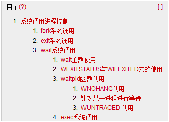

# Linux 学习记录--进程控制相关系统调用  

  

# 系统调用：进程控制  
## fork 系统调用  

**函数作用：**创建一个子进程  
**形式：**pid_tfork(void);  
      pid_t vfork(void);  
**说明：**使用 vfork 创子进程时，不会进程父进程的上下文  
**返回值：**[返回值=-1]子进程创建失败  
       [返回值=0]子进程创建成功  
       [返回值>0]对父进程返回子进程 PID  

```
#include <stdio.h>
#include <sys/stat.h>
#include <unistd.h>
int main() {
    pid_t id = fork();
    if (id < 0) {
        perror("子进程创建失败！");
    } else {
        if (id == 0) {
            printf("子进程工作:PID=%d,PPID=%d\n", getpid(), getppid());
        }else
        {
            printf("父进程工作:PID=%d,PPID=%d，子进程PID=%d\n", getpid(), getppid(),id);
            sleep(5)
        }
    }
}
```

**控制台输出**  
父进程工作:PID=3173,PPID=2432，子进程 PID=3176  
子进程工作:PID=3176,PPID=3173  

## exit 系统调用  

**函数作用：**终止发出调用的进程  
**形式：**voidexit(int status);  
**说明**  
1.      exit 返回信息可由 wait 系统函数获得  
2.      如果父进程先退出子进程的关系被转到 init 进程下  

```
#include <stdio.h>
#include <sys/stat.h>
#include <unistd.h>
#include <stdlib.h>
int main() {
    pid_t id = fork();
    if (id < 0) {
        perror("子进程创建失败！");
    } else {
        if (id == 0) {
            printf("子进程工作:PID=%d,PPID=%d\n", getpid(), getppid());
            sleep(20);
            printf("此时子进程:PID=%d,PPID=%d\n", getpid(), getppid());
        }else
        {
            printf("父进程工作:PID=%d,PPID=%d，子进程PID=%d\n", getpid(), getppid(),id);
            sleep(5);
            exit(3);
        }
    }
    return 0;
}
```

**控制台输出**  
父进程工作:PID=3068,PPID=2432，子进程 PID=3071  
子进程工作:PID=3071,PPID=3068  
此时子进程:PID=3071,PPID=1  

## wait 系统调用  

**函数作用：**父进程与子进程同步，父进程调用后。进入睡眠状态，直到子进程结束或者父进程在被其他进程终止，  
**形式：**pid_twait(int *status)  
pid_t waitpid(pid_t pid ,int *status,int option)  
**参数：**statusè exit 是设置的代码  
pid è 进程号  
option: WNOHANG|WUNTRACED  

WNOHANG:,即使没有子进程退出,它也会立即返回,不会像 wait 那样永远等下去.  
WUNTRACED:子进程进入暂停则马上返回,但结束状态不予以理会.  
返回值：如果成功等待子进程结束，则返回子进程 PID。后者为-1  

用来检查子进程返回状态的宏  
WIFEXITED 这个宏用来指出子进程是否为正常退出的,如果是,它会返回一个非零值.  
WEXITSTATUS 当 WIFEXITED 返回非零值时,我们可以用这个宏来提取子进程的返回值  

### wait 函数使用  

```
#include <sys/types.h>
#include <sys/uio.h>
#include <string.h>
#include <fcntl.h>
#include <unistd.h>
#include <sys/wait.h>
#include <stdio.h>
#include <stdlib.h>
int main() {
    pid_t cid;
    cid = fork();
    if (cid < 0) {
        perror("子进程创建失败！");
    } else {
        if (cid == 0) {
            printf("子进程工作\n");
            printf("子进程PID=%d,PPID=%d\n", getpid(),getppid());
            //sleep(20); //1
        } else {
            //wait(NULL);//2
            //sleep(20);//3
            printf("父进程工作\n");
            printf("父进程PID=%d,PPID=%d\n", getpid(),getppid());
        }
    }
    return 0;
}
```

**针对上述代码作以下分析：**  
**1.       当子进程退出时，如果父进程没有 wait 进行回收资源，子进程就会一直变为僵尸进程（Z）直到父进程退出**  
**作法：**  
打开3处注释后执行程序，查看进程状态，如下  
[root@localhostDebug]# ps -C Process -o pid,ppid,stat,cmd  
PID PPID STAT CMD  
12233 11563S   /root/workspace/Process/Debug/Process  
12238 12233Z    [Process] <defunct>  
=>可以看到子进程此时的状态时 Z（僵尸进程）  

**控制台输出如下**  
子进程工作  
子进程 PID=12238,PPID=12233  
（20S后…..）  
父进程工作  
父进程 PID=12233,PPID=11563  

**2.       使用 wait 进行进程同步，父进程直到子进程退出，wait 才会结束等待**  
**作法：**  
打开1，2处注释后执行程序，查看进程状态，如下  
[root@ Debug8$] ps -C Process -o pid,ppid,stat,cmd  
PID PPID STAT CMD  
3425 2432 S   /root/workspace/Process/Debug/Process  
3430 3425 S   /root/workspace/Process/Debug/Process  
=>父进程与子进程都处于 sleep 状态  

**控制台输出如下**  
子进程工作  
子进程 PID=3430,PPID=3425  
（20S后…..）  
父进程工作  
父进程 PID=3425,PPID=2432  

**3. 使用 wait 进行进程同步，子进程退出后，父进程结束 wait 等待，同时清空子进程信息，此时子进程不再是僵尸进程**  
**作法：**  
打开2，3处注释后执行程序，查看进程状态，如下  

**[root@localhostDebug]# ps -C Process -o pid,ppid,stat,cmd**  
 **PID PPID STAT CMD**  
**1250611563 S   /root/workspace/Process/Debug/****Process**  
=>可以看到此时只有父进程信息  

**控制台输出如下**  
子进程工作  
子进程 PID=12511,PPID=12506  
（20S后…..）  
父进程工作  
父进程 PID=12506,PPID=11563  

### WEXITSTATUS 与 WIFEXITED 宏的使用  

```
#include <sys/types.h>
#include <sys/uio.h>
#include <fcntl.h>
#include <unistd.h>
#include <sys/wait.h>
#include <stdio.h>
#include <stdlib.h>
int main() {
    pid_t cid;
    int pr, status;
    cid = fork();
    if (cid < 0) {
        perror("子进程创建失败！");
    } else {
        if (cid == 0) {
            printf("子进程工作 PID=%d,父进程 PID=%d\n", getpid(),getppid());
            sleep(20);
            exit(3);
        } else {
            pr = wait(&status);
            if (WIFEXITED(status)) {
                printf("父进程工作 PID=%d\n", getpid());
                printf("WAIT 返回值=%d\n", pr);
                printf("子进程正常退出 PID=%d\n", getpid());
                printf("WIFEXITED(status)=%d\n", WIFEXITED(status));
                printf("WEXITSTATUS(status)=%d\n", WEXITSTATUS(status));
            } else {
                printf("子进程异常退出 PID=%d,信号=%d\n", getpid(), status);
                printf("WAIT 返回值=%d\n", pr);
            }
        }
    }
    return 0;
}
```

**基于上面代码做出分析：**  

**1.       子进程正常退出**  
**控制台输出信息如下：**  
子进程工作 PID=12070,父进程 PID=12069  
（20S后…..）  
父进程工作 PID=12069  
WAIT 返回值=12070  
子进程正常退出 PID=12069  
WIFEXITED(status)=1  
WEXITSTATUS(status)=3  

**2.       子进程异常退出**  
**作法：**  
**运行程序，在子进程 SLEEP 期间，杀死子进程**  
[root@localhost Debug]# kill -9 11990  

**控制台台输出如下**  
子进程工作 PID=11990,父进程 PID=11985  
（kill -9 PID 杀死子进程）  
子进程异常退出 PID=11985,信号=9  
**可以看出子进程正常退出时，status 返回值是 exit 的退出值，子进程异常退出时 status 返回值信号值**  

### waitpid 函数使用  

**waitpid 的参数说明**  

**参数 pid 的值有以下几种类型:**  
pid>0时,只等待进程 ID 等于 pid 的子进程,不管其它已经有多少子进程运行结束退出了,只要指定的子进程还没有结束,waitpid 就会一直等下去.  
pid=-1时,等待任何一个子进程退出,没有任何限制,此时 waitpid 和 wait 的作用一模一样.  
pid=0时,等待同一个进程组中的任何子进程,如果子进程已经加入了别的进程组，waitpid 不会对它做任何理睬.  
pid<-1时,等待一个指定进程组中的任何子进程,这个进程组的 ID 等于 pid 的绝对值.  

**参数 options 的值有以下几种类型:**  
如果使用了 WNOHANG 参数,即使没有子进程退出,它也会立即返回,不会像 wait 那样永远等下去.  
如果使用了 WUNTRACED 参数,则子进程进入暂停则马上返回,但结束状态不予以理会.  
如果我们不想使用它们,也可以把 options 设为0,如:ret=waitpid(-1,NULL,0);  

**WNOHANG 使用**  

```
#include <sys/types.h>
#include <sys/uio.h>
#include <fcntl.h>
#include <unistd.h>
#include <sys/wait.h>
#include <stdio.h>
#include <stdlib.h>
int main() {
    pid_t cid;
    int pr, status;
    cid = fork();
    if (cid < 0) {
        perror("子进程创建失败！");
    } else {
        if (cid == 0) {
            printf("子进程工作 PID=%d\n", getpid());
            sleep(5);
            exit(3);
        } else {
            do{
                pr = waitpid(0,&status, WNOHANG);
                if(pr==0)
                {
                 printf("没有子进程退出,继续执行..\n");
                 sleep(1);
                }
            }while(pr==0);
            printf("子进程正常退出 PID=%d\n", pr);
        }
    }
    return 0;
}
```
**控制台输出：**  

没有子进程退出,继续执行..  
子进程工作 PID=3632  
没有子进程退出,继续执行..  
没有子进程退出,继续执行..  
没有子进程退出,继续执行..  
没有子进程退出,继续执行..  
子进程正常退出 PID=3632  

**针对某一进程进行等待**  

```
#include <sys/types.h>
#include <unistd.h>
#include <sys/wait.h>
#include <stdio.h>
#include <stdlib.h>
int main() {
    pid_t cid;
    int pr, status;
    cid = fork();
    if (cid < 0) {
        perror("子进程创建失败！");
    } else {
        if (cid == 0) {
            printf("子进程工作 PID=%d,PPID=%d\n", getpid(), getppid());
            sleep(20);
            exit(3);
        } else {
            pr = waitpid(cid, &status, 0);
            printf("父进程正常退出 PID=%d\n", pr);
        }
    }
    return 0;
}
```

**控制台输出**  
子进程工作 PID=4257,PPID=4252  
父进程正常退出 PID=4257  

### WUNTRACED 使用

```
#include <sys/types.h>
#include <unistd.h>
#include <sys/wait.h>
#include <stdio.h>
#include <stdlib.h>
int main() {
    pid_t cid;
    int pr, status;
    cid = fork();
    if (cid < 0) {
        perror("子进程创建失败！");
    } else {
        if (cid == 0) {
            printf("子进程工作 PID=%d,PPID=%d\n", getpid(), getppid());
            sleep(30);
            exit(3);
        } else {
            pr = waitpid(cid, &status, WUNTRACED);
            printf("父进程正常退出 PID=%d,status=%d\n", pr,status);
        }
    }
    return 0;
}
```

**作法：**在子进程 SLEEP 时，通过 SHELL 命令停止子进程  
[root@ ~ 6$] kill -STOP PID  

**控制台输出**  
子进程工作 PID=4110,PPID=4108  
(SLEEP 期间，停止子进程)  
父进程正常退出 PID=4110,status=4991  
在查看进程状态，发现此时父进程子进程都已经退出  
[root@ Debug 13$] ps -C Process -opid,ppid,stat,cmd  
PID  PPID STAT CMD  

## exec 系统调用  

**函数作用：**以新进程代替原有进程，但 PID 保持不变  
**形式:**  
int execl(const char *path, const char*arg, ...);  
int execlp(const char *file, const char*arg, ...);  
int execle(const char *path, const char*arg, ..., char * const envp[]);  
int execv(const char *path, char *constargv[]);  
int execvp(const char *file, char *constargv[]);  
int execve(const char *path, char *constargv[], char *const envp[]);  

**举例：**  

```
exec1.c
#include <stdio.h>
#include <unistd.h>
int main()
{
  printf("这是第一个进程 PID=%d\n",getpid());
  execv("e2",NULL);
  printf("asa");
  return 0;
}
exec2.c
#include <stdio.h>
#include <unistd.h>
int main()
{
  printf("这是第二个进程 PID=%d\n",getpid());
}
```

**运行结果：**    
[root@ Process 9$] gcc -o e1 exec1.c  
[root@ Process 10$] gcc -o e2 exec2.c  
[root@ Process 11$] ./e1  
这是第一个进程 PID=3051  
这是第二个进程 PID=3051  

本文出自 “StarFlex” 博客，请务必保留此出处[http://tiankefeng.blog.51cto.com/8687281/1372503](http://tiankefeng.blog.51cto.com/8687281/1372503)