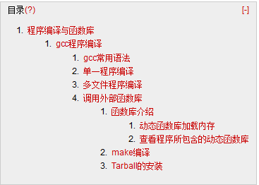

# Linux 学习记录--程序编译与函数库



# 程序编译与函数库
前面提到过对于机器来说只能识别0,1，我们如果让机器运行必须输入机器能够识别的语言，可是机器语言不利于人们使用可理解，因此科学家就开发出人类能看的懂的程序语言，然后再创造出“编译器”将程序语言转换为机器语言。  
C 语言就是我们能够看懂的机器语言，gcc 就是 Linux 下编译器。我们通常 C 语言写的程序通过 gcc 编译后，就能成为机器能够识别的语言  

## gcc 程序编译  
如果 LINUX 系统中为安装 GCC 编译器，可以使用下面命令安装  
[root@bogon ~]# yum install gcc  

### gcc 常用语法  
语法：
gcc  –c  file.c  
仅将源代码编译成目标文件。并不会进行链接以及生成可执行文件  

gcc –o 执行文件名 源代码文件  
直接生成指定名称的执行文件。但不会生成目标文件  

gcc –o 执行文件名 目标文件  
通过目标文件生成可执行文件  

gcc [其他编译操作]  –L库文件路径  
查找库文件的路径默认是/usr/lib 与/ib  

gcc  [其他编译操作] –I 包含文件路径  
查找包含文件的路径默认是/usr/include  

gcc  [其他编译操作] –Wall  
更加严谨的编译方式，会输出很多警告信息  

gcc  -O  [其他编译操作]  
编译时依据操作环境优化执行速度  

gcc  [其他编译操作] –l库文件名称  
编译时引入其他的库文件，其中库文件 lib 与扩展名不需要写。如引入 libm.so 文件，可写成-lm  

### 单一程序编译  

1.       编写 C 语言程序 l  

```
[root@bogon code]# vim hello.c
#include <stdio.h>
int main(void)
{
   printf("hello world!");
}
```

2.       编译  

```
[root@bogon code]# gcc hello.c 
[root@bogon code]# ll hello.c a.out 
-rwxr-xr-x 1 root root 4947 04-05 16:07 a.out
-rw-r--r-- 1 root root   66 04-05 16:07 hello.c
```

说明：默认 gcc 编译器编译出来的执行文件 a.out, 可以使用-o 来制定编译后生产的执行文件名称  

```
[root@bogon code]# gcc -o hello hello.c 
[root@bogon code]# ll hello
-rwxr-xr-x 1 root root 4947 04-05 16:11 hello
```

3.      执行  

```
[root@bogon code]# ./a.out 
hello world!

[root@bogon code]# ./hello 
hello world!
```

### 多文件程序编译  
假设我们有 A.c ,B.c 两个程序文件，并且他们之间存在函数调用，那么当其中有一个文件更改了。是不是需要将这两个文件都重新编译？当然不需要，这就需要引入目标文件  
目标文件：编译器编译源代码后生成的文件，目标文件从结构上讲，它是已经编译后的可执行文件格式，只是没有经过链接的过程。
接着上面的说，当 B.c 文件更改时，我们执行重新编译 B 文件生产目标文件。再讲整体链接即可   

1.       编写 C 语言程序  

```
File:A.c
#include <stdio.h>
#include “B.c”
int main ()
{
printf("这是第一个文件\n");
method();
}

File:B.c
#include <stdio.h>
void method(void)
{
 printf("这是第二个文件！\n";)
}
```

2.       编译  

```
root@bogon code]# gcc -c A.c B.c -I./
[root@bogon code]# ll 
-rw-r--r-- 1 root root   81 04-05 16:35 A.c
-rw-r--r-- 1 root root  912 04-05 16:35 A.o
-rw-r--r-- 1 root root   80 04-05 16:34 B.c
-rw-r--r-- 1 root root  860 04-05 16:35 B.o
```

3.    链接  

```
[root@bogon code]# gcc -o result A.o B.o
```

4.       执行  

```
[root@bogon code]# ./result 
这是第一个文件
这是第二个文件！
```

5.  更改 B.c 文件  

```
#include <stdio.h>
void method(void)
{
 printf("这是更改后第二个文件！\n";)
}
```

6.       重新编译链接执行  

```
[root@bogon code]# gcc -c B.c =>只编译了B这个文件
[root@bogon code]# gcc -o result A.o B.o
[root@bogon code]# ./result 
这是第一个文件
这是更改后第二个文件！
```

### 调用外部函数库  
1.       编写 C 语言程序  

```
#include<stdio.h>
#include<math.h>
 
int main ()
{
  float val=sin(3.14);
  printf("val值是：%f\n",val);
}
```

2.       编译与执行  

```
[root@bogon code]# gcc -o sinmath sinmath.c -lm
[root@bogon code]# ./sinmath 
val值是：0.001593
```

**函数库介绍**  
函数库依照是否编译到程序内部可分为  
静态函数库：通常以.a 为扩展名，编译时会整合到程序文件中  
动态函数库：通常以.so 为扩展名，编译时会不会整合到程序文件中，只是在程序文件中存在一个指向的位置  
因此程序执行时是不需要静态函数库的，但是需要动态函数库，使用动态函数库的好处再在可以减少程序文件的大小  

**动态函数库加载内存**  
我们知道内存的访问速度是硬盘的好几倍，如果先将动态函数库加载到内存中，那么在使用动态函数库时就会，就会提高很多效率
  
语法：ldconfig[-f 需要缓存函数库信息所在文件] [-C 已缓存函数库信息所在文件]  
            ldconfig –p 列出已缓存函数库信息  

需要缓存函数库信息所在文件:在这个文件中记录所有需要缓存的的函数库默认值是  
/etc/ ld.so.conf  

举例：查看下我的系统下缓存的函数库  

```
[root@bogon etc]# vim ld.so.conf
include ld.so.conf.d/*.conf

[root@bogon etc]# cd ld.so.conf.d/
[root@bogon ld.so.conf.d]# ll
-rw-r--r-- 1 root root  15 2013-01-23 mysql-i386.conf
-rw-r--r-- 1 root root  17 2013-01-09 openais-athlon.conf
-rw-r--r-- 1 root root  20 2012-08-20 qt-i386.conf
-rw-r--r-- 1 root root 276 02-22 19:23 vmware-tools-libraries.conf
-rw-r--r-- 1 root root  19 2013-08-07 xulrunner-32.conf
[root@bogon ld.so.conf.d]# vim mysql-i386.conf 
[root@bogon ld.so.conf.d]# ll /usr/lib/mysql
lrwxrwxrwx 1 root root      26 02-18 20:03 libmysqlclient_r.so.15 -> libmysqlclient_r.so.15.0.0
-rwxr-xr-x 1 root root 1460684 2013-01-23 libmysqlclient_r.so.15.0.0
lrwxrwxrwx 1 root root      24 02-18 20:03 libmysqlclient.so.15 -> libmysqlclient.so.15.0.0
-rwxr-xr-x 1 root root 1452764 2013-01-23 libmysqlclient.so.15.0.0
-rwxr-xr-x 1 root root   13220 2013-01-23 mysqlbug
-rwxr-xr-x 1 root root    6215 2013-01-23 mysql_config
```

已缓存函数库信息所在文件：这个文件中记录了已经缓存的函数库，默认文件为  
/etc/ld.so.cache ,通过-p 查询到的信息就是从这个文件读取而来  

举例：查看所有已缓存的函数库  

```
[root@bogon ld.so.conf.d]# ldconfig -p|more
947 libs found in cache `/etc/ld.so.cache'
        libz.so.1 (libc6) => /lib/libz.so.1
        libz.so.1 (libc6) => /usr/lib/libz.so.1
        libx11globalcomm.so.1 (libc6) => /usr/lib/libx11globalcomm.so.1
   ……..
```

**查看程序所包含的动态函数库**  
语法：ldd –v 文件名  
-v:列出所有函数库信息  

举例：  

```
[root@bogon ld.so.conf.d]# ldd  /usr/bin/passwd
        linux-gate.so.1 =>  (0x00ddc000)
        libuser.so.1 => /usr/lib/libuser.so.1 (0x007c5000)
        libcrypt.so.1 => /lib/libcrypt.so.1 (0x05c74000)
       ……
```

## make 编译  
如果一个程序中有很多文件，那么还像上面那样讲每个文件列出来在进行编译就会很麻烦。因此这种时候就需要使用 make 工具了

Make 编译好处  
简化编译时所需的指令  
若在编译完成后，修改了某个源文件，只会针对修改的文件编译  

Make 使用方法  
Make 是有个二进制文件，其会查找当前目录下的 Makefile 文件，根据其里面定义的内容执行操作。 Makefile 里面包含了若干目标与操作  

其基本关于规则如下  
目标：  
<tab>操作  

```
REST2HTML=html.py --compact-lists --date --generator

all: user_manual.html dev_manual.html

user_manual.html: user_manual.rst
        $(REST2HTML) user_manual.rst user_manual.html

dev_manual.html: dev_manual.rst
        $(REST2HTML) dev_manual.rst dev_manual.html

clean:
        rm *.html
```

以上内容分为三个目标 all，user_manual.html，clean，其下面分别对应的是其操作  
我们可以通过 make 后面参数为目标进行执行。如：make clean  

## Tarball 的安装  
由于 Unix like 具有很多种。因此一个软件安装包不可能适用所有所本，因此有时我们需要根据软件提供者提供的源码自行编译，以满足在自己的操作系统上运行  

大部分软件开发包编译与安装的流程大致是这样的  
1.      讲压缩文件解压缩  
2.      解压缩后执行里面的 configure 文件，其作用就是建立 makefile 文件  
3.      Make clean:清理一些上次操作的残留  
4.      Make :默认操作进行编译的行为  
5.      Make install:安装  

说明：安装前如果有安装文档最好先查阅  
3-4步骤 不一定都存在。可查看 makefile 内容判断具体包括哪些目标  

举例：  

```
[root@bogon shared]# tar -zxvf ntp-4.2.4p7.tar.gz -C /tmp
…..
[root@bogon ntp-4.2.4p7]# ./configure --prefix=/usr/loacl/ntp
=> --prefix=/usr/loacl/ntp 为指定安装目录
[root@bogon ntp-4.2.4p7]# ll Makefile
-rw-r--r-- 1 root 6011 23950 04-05 21:40 Makefile
=>生成了Makefile文件
root@bogon ntp-4.2.4p7]# ll Makefile
root@bogon ntp-4.2.4p7]# make clean
root@bogon ntp-4.2.4p7]# make 
root@bogon ntp-4.2.4p7]# make install
```

本文出自 “StarFlex” 博客，请务必保留此出处[http://tiankefeng.blog.51cto.com/8687281/1372503](http://tiankefeng.blog.51cto.com/8687281/1372503)