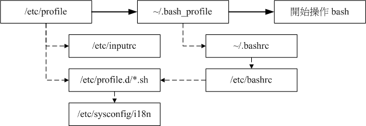

# Linux 学习记录--shell 介绍  

# shell  

## 命令类型查询:type  
## 读入配置文件:source  

操作系统内核(kernel)负责管理整个计算机硬件，但是这个内核是需要保护的，用户不能直接操作内核，因此就需要一个可以帮助我们操作内核的工具。Shell 功能就在于此，他可以将我们输入的命令与内核通信，好让内核可以控制硬件来正确无误地工作  

**我们使用的是 linux 默认 shell 即 bash shell,其主要功能是：**  
命令记忆功能：  
命令与文件不全功能  
命名别名设置功能  
作业控制，前台，后台控制  
程序脚本  
通配符  

## 命令类型查询(type)  

**对于 shell 能够识别的变量分为：**   
**内部命令：**由 bash 内置的命令  
**外部命令：**来字外部的命令，非 bash 内置   
**语法：**type [-tpa] name   
**选项与参数：**不加任何参数是，会显示出是内部命令还是外部命令   
-t:会已以下关键字说明命令的意义   
        File:外部命令  
        Alias:通过别名设置的命令  
        Builtin:内置命令   
-p:-如果后面接的是外部命令时才会显示完整文件名   
-a:会有 PATH 变量定义的路径中，所有 name 命令列出来，包括 alias   

**举例：**  

```
[root@localhost ~]# type ls
ls is aliased to `ls --color=tty'
[root@localhost ~]# type -t ls
alias
[root@localhost ~]# type cd 
cd is a shell builtin
[root@localhost ~]# type egrep
egrep is hashed (/bin/egrep)
[root@localhost ~]# type -t egrep
file
[root@localhost ~]# type -p egrep
/bin/egrep
```

## 路径与命令查找顺序  
在我们系统中存在多个名字相同的名字，那么 bash shell 究竟使用的是哪个命令呢？其遵循的顺序如下：   
1．以相对/绝对路径来执行命令   
2．由 alias 找到命令来执行  
3．由 bash 内置命令来执行  
4．通过$PATH 的顺序找到的第一个命令来执行  

**举例**   

```
[root@localhost ~]# alias echo='echo -n'
[root@localhost ~]# type -a echo
echo is aliased to `echo -n'
echo is a shell builtin
echo is /bin/echo
=>可以看到先找alias在内置命令 最后PATH
```

## Bash 的环境配置文件  
当我们进如 bash 之后虽然我们什么也没有设置，但是系统的一些变量已经别名等信息就已经设置好了，这些信息就存在环境配置文件中，bash 启动时就会读取这些文件，对配置信息进行加载和设置 

**环境配置文件分类：**  
整体配置文件  
个人配置文件   

## 配置文件读取流程   
用户输入完正确的用户名密码获得的 bash 首先会读取   
1./etc/profile   
这个文件设置的只要变量有 PATH,MAIL,USER,HOSTNAME.HISTSIZE,接下来调用其他文件加载数据
2./etc/inputrc   
3./etc/profile.d/*.sh    
这个目录下的文件规定了 bash 的操作借口颜色，语系，公共别名等信息   
4./etc/sysconfig/i18n   
这个文件由/etc/profile.d/lang.sh 调用复制设置语系   
以上为整体配置文件，设置完成后开始设置个人配置文件   
5.~/.bash_profile   
~/.bash_profile,~/.bash_login ~/.profile 三个文件只读取一个，而且顺序按照前面的顺序   

```
root@localhost ~]# cat ~/.bash_profile 
# .bash_profile

# Get the aliases and functions
if [ -f ~/.bashrc ]; then
        . ~/.bashrc
fi

# User specific environment and startup programs

PATH=$PATH:$HOME/bin

export PATH
unset USERNAME
```

在这个文件中将用户主目录添加到 PATH 中，并将 PATH 变为环境变量。并且还回去读取~/.bashrc 文件（我通常将我个人的配置信息写到这里，如别名）   

 

**其他重要配置文件**    
/etc/man.config: 这个文件中记录了帮助信息在哪里  
~/.bash_history:记录操作命令历史记录   
~./bash_loyout:注销时系统做的事情记录在这里    

# 读入环境配置文件(source)   
环境配置文件只有 bash 在启动时读入，如果启动以后再修改就需要重新登录，才能让配置文件再一次被读入，source 命令就是避免重新登录，使修改后的配置文件重新读入后立即生效   
**语法：**source 配置文件名   
 
## 终端机环境设置  
终端机中有的按键代表特殊的意义，如[backspace]代表删除，[ctrl+c]代表终止命令。在不同的Linux distributions 中终端机环境设置不尽相同。Stty 可以查看并设置这些命令   
**语法：**stty –a  
             stty name 热键  
**选项与参数：**   
-a:查看所有环境中所有按键设置   
name:按键设置名称   

**举例：查看所有按键信息**   

```
[root@localhost ~]# stty -a
speed 38400 baud; rows 41; columns 143; line = 0;
intr = ^C; quit = ^\; erase = ^?; kill = ^U; eof = ^D; eol = M-^?; eol2 = M-^?; swtch = M-^?; start = ^Q; stop = ^S; susp = ^Z; rprnt = ^R;
werase = ^W; lnext = ^V; flush = ^O; min = 1; time = 0;
-parenb -parodd cs8 hupcl -cstopb cread -clocal -crtscts -cdtrdsr
-ignbrk brkint -ignpar -parmrk -inpck -istrip -inlcr -igncr icrnl ixon -ixoff -iuclc ixany imaxbel iutf8
opost -olcuc -ocrnl onlcr -onocr -onlret -ofill -ofdel nl0 cr0 tab0 bs0 vt0 ff0
isig icanon iexten echo echoe echok -echonl -noflsh -xcase -tostop -echoprt echoctl echoke
```

**几个重要的内容：**  
Eof:代表输入结束   
Erase:删除字符操作  
Intr:终止目前命令   
Kill:在提示符下，将正行命令删除  
Quit:送出 quit 给正在运行的程勋   
Start:暂停屏幕的输出  
Stop:回复屏幕的输出   
Susp: 暂停目前命令   

**举例2：修改按键信息**   

```
[root@localhost ~]# stty erase ^h
=>将删除字符按键变为[ctrl+h],此时[backspace]按键变成[ctrl+？]操作,
[root@localhost ~]# stty -a
speed 38400 baud; rows 41; columns 143; line = 0;
intr = ^C; quit = ^\; erase = ^H; kill = ^U; eof = ^D; eol = M-^?; eol2 = M-^?; swtch = M-^?; start = ^Q; stop = ^S; susp = ^Z; rprnt = ^R;
```

## 通配符  
Bash shell 特点之一就是通配符，可以方便我们查找。  

**说明：**通配符和正则表达式不是一个东西  
**常用的通配符：**  
*：代表0~n 个任意字符  
?: 代表一定有一个字符   
[]:代表一定有一个括号内的字符   
[-]代表一定是连续字符中的一个.例如：[0-9]代表一个是0-9中的一个字符。前提字符必须是连续的  
[^]:^表示反向选择例如[^abc]代表一个非 abc 的字符    

**举例：**   

```
[root@ localhost ~]# LANG=C         <==由于与编码有关（字符连续），先配置语系
找出 /etc/ 底下以 cron 为开头的档名
[root@ localhost ~]# ll -d /etc/cron*    <==加上 -d 是为了仅显示目录而已
找出 /etc/ 底下文件名『刚好是五个字母』的文件名
[root@ localhost ~]# ll -d /etc/?????    
找出 /etc/ 底下文件名含有数字的文件名
[root@ localhost ~]# ll -d /etc/*[0-9]* 
找出 /etc/ 底下，档名开头非为小写字母的文件名：
[root@ localhost ~]# ll -d /etc/[^a-z]* 
```

本文出自 “StarFlex” 博客，请务必保留此出处[http://tiankefeng.blog.51cto.com/8687281/1372503](http://tiankefeng.blog.51cto.com/8687281/1372503)