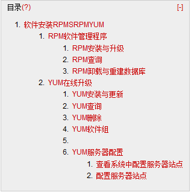

# Linux 学习记录--软件安装 RPM|SRPM|YUM  

   

# 软件安装RPM|SRPM|YUM  
前面说到了软件安装可以直接下载源码压缩版编译安装。还有一种安装形式是使用厂商提供给用户的安装文件。厂商在他们的系统上编译好用户所需要的软件，然后将编译好的软件发布给用户使用。  

目前厂商发布软件机制主要分为2大类  
Dpkg:由 Debian Linux 社区开发，B2D,Ubantu 等 Linuxdistributions 使用就是这种机制  
RPM:由 Red Hat 开发，CentOs,SuSe 使用就是这种机制  
这两种机制安装软件会先检测前驱软件是否存在，如果不存在则不安装.如软件 A 安装。需系统内含有软件 B，那么不存在则不会安装软件  
为了解决这种因依赖问题而导致软件不能安装厂商又提供了在线升级机制，简单的说就是先将前驱软件都安装以保证要安的软件能正确安装  

Dpkg 机制对应的在线升级机制 APT  
RPM 机制对应的在线升级机制 YUM  

## RPM 软件管理程序  
Rpm 软件相关信息会写入/var/lib/rpm 目录下的数据库文件内，未来软件升级以及版本比较都源自这个数据库，查询已安装 RPM 软件也会查询这个数据库  

### RPM 安装与升级  
前面提到过 RPM 软件的安装前会检查前驱依赖的软件是否已安装，如果为安装则此次安装不会进行，同时需要说明 PRM 机制软件是厂商根据特定系统所提供，因此不同的 Linux distributions，以及不同版本之间 PRM 机制软件是不能相互安装的  

语法：rpm –[i|F|U]vh 软件名  
选项与参数  
-i: 安装  
-U：后接的软件如果没有安装过则安装，如果安装过且版本较旧则更新  
-F:后接的软件如未安装则不进行安装，如果安装过且版本较旧则更新  
-v:查看详细安装信息  
-h:显示安装进度  

举例1:安装  

```
[root@localhost ~]# 
rpm -ivh /media/CentOS_5.10_Final/CentOS/pam-devel-0.99.6.2-12.el5.i386.rpm 
Preparing...                ########################################### [100%]
   1:pam-devel              ########################################### [100%]
```

举例2：存在依赖的安装  

```
[root@localhost ~]# rpm -i /media/CentOS_5.10_Final/CentOS/ant17-junit-1.7.1-1jpp.0.i386.rpm
error: Failed dependencies:
        ant17 = 0:1.7.1-1jpp.0 is needed by ant17-junit-1.7.1-1jpp.0.i386
        junit is needed by ant17-junit-1.7.1-1jpp.0.i386
=>提示其前驱软件为安装
```

### RPM 查询  
语法： rpm –qa  
rpm –q[iR] 存在于系统的软件名  
rpm –qf 存在于系统的某个文件名  
rpm -qp[iR] 未安装的某个文件名  

-q:进查询后面接的软件名是否安装  
-qa：列出所有已安装的软件信息  
-qi ：列出后面接软件的详细信息  
-qR:列出与该软件有关的依赖软件所含的文件  
-qf:由后面接的文件名称找出还文件属于哪一个以安装的软件  

查询某个未安装软件包含文件的信息  
-qp[iR]:iR 属于与上面说的一致  

```
[root@localhost ~]# rpm -q pam-devel =>不需要列出版本号
pam-devel-0.99.6.2-12.el5

[root@localhost ~]# rpm -qi pam-devel
Name        : pam-devel                    Relocations: (not relocatable)
Version     : 0.99.6.2                          Vendor: CentOS
Release     : 12.el5                        Build Date: 2013年01月09日星期三 13时30分55秒
Install Date: 2014年04月08日星期二 14时19分02秒      Build Host: builder17.centos.org
Group       : Development/Libraries         Source RPM: pam-0.99.6.2-12.el5.src.rpm
Size        : 504034                           License: GPL or BSD
Signature   : DSA/SHA1, 2013年01月10日星期四 03时18分55秒, Key ID a8a447dce8562897
URL         : http://www.us.kernel.org/pub/linux/libs/pam/index.html
Summary     : Files needed for developing PAM-aware applications and modules for PAM
Description :
PAM(可插入验证模块)是一个系统安全工具。它允许
系统管理员无需重新编译处理验证的程序而设置验证
策略。该软件包包括用于建构留意 PAM 的程序和 PAM
使用的模块所需的头文件和静态库。

[root@localhost ~]# rpm -qR pam-devel
libpam.so.0  
libpam_misc.so.0  
libpamc.so.0  
pam = 0.99.6.2-12.el5
rpmlib(CompressedFileNames) <= 3.0.4-1
rpmlib(PayloadFilesHavePrefix) <= 4.0-1

[root@localhost ~]# rpm -qf /usr/lib/libpam.so
pam-devel-0.99.6.2-12.el5

[root@localhost ~]# rpm –qa
tomcat5-servlet-2.4-api-5.5.23-0jpp.40.el5_9
xml-commons-resolver-1.1-1jpp.12
…..
```

### RPM 卸载与重建数据库  
卸载：rpm –e 软件名  
重建数据库：rpm –rebuilddb  

## YUM 在线升级  
前面说到 RPM 软件安装是如果存在前驱软件且未安装此次安装就不会进行，为了解决这个问题，就引入了 YUM 在线升级机制，简答的说，YUM 在线升级机制就是将需要安装的软件的前驱软件(RPM)事先都进行安装以保障软件的顺利安装  

### YUM 安装与更新  
语法：yum  [option]  [install|update]  
Option:  
-y:安装过程中询问用户操作，默认是 yes  
-installroot=路径：软件安装路径  
install：安装操作  
update 更新操作  

举例：  

```
[root@bogon ~]# yum -y install pam-devel
Loaded plugins: fastestmirror, security
Loading mirror speeds from cached hostfile
 * base: mirrors.yun-idc.com
 * extras: mirrors.yun-idc.com
 * updates: mirrors.yun-idc.com
Setting up Install Process
Resolving Dependencies
--> Running transaction check
---> Package pam-devel.i386 0:0.99.6.2-12.el5 set to be updated
--> Finished Dependency Resolution
………………….
  Installing     : pam-devel                                                                                                               1/1 
Installed:
  pam-devel.i386 0:0.99.6.2-12.el5                                                                                                             
Complete!
```

### YUM 查询  
语法：yum[search|info |provides]软件名  
yum list|list updates  

search: 查询后接名称的相关的软件  
info: 查询后接软件的相关信息  
provides:查询提供后接文件的软件有哪些  
list:列出服务器上所提供的软件  
list updates：列出服务器上可供升级的软件  

举例：  
 
```
[root@bogon ~]# yum search pam
…….
pam.i386 : A security tool which provides authentication for applications
pam-devel.i386 : Files needed for developing PAM-aware applications and modules for PAM
…..
[root@bogon ~]# yum info pam-devel
……
Installed Packages
Name       : pam-devel
Arch       : i386
Version    : 0.99.6.2
Release    : 12.el5
Size       : 492 k
Repo       : installed
Summary    : Files needed for developing PAM-aware applications and modules for PAM
URL        : http://www.us.kernel.org/pub/linux/libs/pam/index.html
License    : GPL or BSD
Description: PAM(可插入验证模块)是一个系统安全工具。它允许
           : 系统管理员无需重新编译处理验证的程序而设置验证
           : 策略。该软件包包括用于建构留意 PAM 的程序和 PAM
           : 使用的模块所需的头文件和静态库。

[root@bogon ~]# yum provides /bin/sh
………
bash-3.2-32.el5_9.1.i386 : The GNU Bourne Again shell (bash) version 3.2
Repo        : base
Matched from:
Filename    : /bin/sh
```

### YUM 删除  
语法：yum [–y]remove 软件名  

举例：  

```
[root@bogon ~]# yum remove pam-devel
Loaded plugins: fastestmirror, security
Setting up Remove Process
Resolving Dependencies
--> Running transaction check
---> Package pam-devel.i386 0:0.99.6.2-12.el5 set to be erased
--> Finished Dependency Resolution
………….
Transaction Test Succeeded
Running Transaction
  Erasing        : pam-devel                                                                                                               1/1 
Removed:
  pam-devel.i386 0:0.99.6.2-12.el5   
```

### YUM 软件组  
前面说的 YUM 安装都是一个一个安装软件，当我们安装一个复杂的功能时可能需要安装很多个软件，比如安装 KDE 桌面系统，其包括很多软件，如果在一个个安装就会很费事。此时就可以使用软件组功能。（至于有哪些软件组。这就需要服务器提供了）  

语法： yum grouplist  
             yum [groupinfo|groupinstall|groupremove] 软件组名  

举例：  
 
```
[root@bogon ~]# yum grouplist
Installed Groups:=>已经安装的软件组
   DNS 名称服务器
   FTP 服务器
  ……..
Available Groups: =>可安装的软件组
   Beagle
   Eclipse
……..
Done
```

### YUM 服务器配置  
Yum 软件在线升级信息都要从远端的服务器端来获取数据，有时我们需要更改下服务器地址，选择些离我们较近，或者资源较好的服务器以提高传输效率，那么服务器配置信息在哪里设置的？  

**查看系统中配置服务器站点**  
语法：yum repolist all  

```
root@bogon ~]# yum repolist all
repo id               repo name                    status
C5.0-base             CentOS-5.0 - Base            disabled
base                  CentOS-5 - Base              enabled
extras                CentOS-5 - Extras            enabled
updates               CentOS-5 - Updates           enabled
=>只有 states 是 enabled 才是被激活的，上面有三个站点是被激活的  
```

当我们查询安装时会看到如下提示信息，就代表从上面三个激活站点查询到的数据  
Loaded plugins: fastestmirror, security  
Loading mirror speeds from cached hostfile  
*base: mirrors.yun-idc.com  
*extras: mirrors.yun-idc.com  
*updates: mirrors.yun-idc.com  

**配置服务器站点**  
服务器配置信息都在/etc/yum.repos.d/目录下  

```
[root@localhost /]# ll /etc/yum.repos.d/
-rw-r--r-- 1 root root 1926 04-02 09:21 CentOS-Base.repo
-rw-r--r-- 1 root root  636 10-08 04:57 CentOS-Debuginfo.repo
-rw-r--r-- 1 root root  626 10-08 04:57 CentOS-Media.repo
-rw-r--r-- 1 root root 7574 10-08 04:57 CentOS-Vault.repo
-rw-r--r-- 1 root root  342 04-02 09:26 mystation.repo
```

以上可见分为4个容器，每个容器内配置了一些列站点  

```
[root@localhost /]# vim /etc/yum.repos.d/CentOS-Base.repo
=>查看包含了哪些站点
[base]
name=CentOS-$releasever - Base
mirrorlist=http://mirrorlist.centos.org/?release=$releasever&arch=$basearch&repo=os
#baseurl=http://mirror.centos.org/centos/$releasever/os/$basearch/
gpgcheck=1
gpgkey=file:///etc/pki/rpm-gpg/RPM-GPG-KEY-CentOS-5
enabled=1
```

名称说明：  
[base]：代表站点的名字！中刮号一定要存在  
name：只是说明一下这个容器的意义而已  
mirrorlist=：列出这个容器可以使用的映射站台，如果不想使用，可以注解到这行；  
baseurl=：因为后面接的就是容器的实际网址！  
enable=1：就是让这个容器被启动。如果不想启动可以使用 enable=0 。  
gpgcheck=1：这就是指定是否需要查阅 RPM 文件内的数码签章！  
gpgkey=：就是数码签章的公钥档所在位置。使用默认值即可  

举例：管理一个站点  

```
[base]
name=CentOS-$releasever - Base
mirrorlist=http://mirrorlist.centos.org/?release=$releasever&arch=$basearch&repo=os
#baseurl=http://mirror.centos.org/centos/$releasever/os/$basearch/
gpgcheck=1
gpgkey=file:///etc/pki/rpm-gpg/RPM-GPG-KEY-CentOS-5
enabled=0

[root@bogon ~]# yum search gcc
Loaded plugins: fastestmirror, security
Loading mirror speeds from cached hostfile
 * extras: mirrors.btte.net
 * updates: mirrors.btte.net
extras                                                                                                                  | 2.1 kB     00:00     
updates      
=>查询站点只剩下2个了
```

对于自定义的服务器地址需要在/etc/yum.repos.d/目录下新建.repo 文件，在里面配置自己的服务器站点  

本文出自 “StarFlex” 博客，请务必保留此出处[http://tiankefeng.blog.51cto.com/8687281/1372503](http://tiankefeng.blog.51cto.com/8687281/1372503)