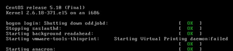

# Linux 学习记录--启动流程  

  

# 启动流程  

**系统的启动过程大致可以分为如下几个步骤：**  

1.      加载 BIOS 的硬件信息与进行自我测试，并依据设置取得第一个可启动的设备  
2.      读取并执行第一个启动设备内 MBR 的 bootloader  
3.      依据 boot loader 的设置加载 kernel,kernel 会开始检测硬件与加载驱动程序  
4.      在硬件驱动成功后，Kernel 会主动调用 init 进程，而 init 进程回去的 run-level 信息  
5.      Init 执行/etc/rc.d/rc.sysinit 文件来准备软件执行的操作系统（网络，时区等）  
6.      Init 执行 run-level 的各个服务的启动  
7.      Init 执行/etc/rc.d/rc.local 文件  
8.      Init 执行终端机模拟程序 mingetty 来启动 login 进程，最后就等待用户登录  

**名词解释**  
BIOS:开机的时候计算机系统会主动执行的程序，它会识别第一个可开机的设备  
MBR:第一个可开机设备的第一个扇区内的主引导分区，内包含 bootloader  
Boot loader:可进行内核与虚拟文件系统加载的软件  
虚拟文件系统(initrd):内存中仿真的根目录，用于当 loader 不能进行根目录挂载时使用  

**根据以上启动流程：我的理解上这样的一个流程**  

设备通电开机 èBIOS 执行 è 认识第一个开机设备 è 将 MBR 内容载入内存  
èbootloader 执行 è 载入内核与 initrdè 根目录挂载 èinitè 登陆系统  

Bootloader 能够识别操作系统文件格式，所以可以解压缩内核到内存中执行，内核在执行中进行测试与驱动各个设备，由于驱动(内核模块)是挂载到/lib/modules 下，如要读取必要先挂在根目录，可挂载根目录必须读取驱动。此处就产生的了矛盾，因此为了解决这个问题引入了 initrd, BootLoader 将initrd 解压缩到内存并在内存中形成一个仿真的根目录，加载启动时是必需的驱动，如磁盘的驱动，并完成根目录实际的挂载，以完成后续的操作  

## Init 处理流程  

(此流程是针对 centos，不同的 UNIX LIKE 流程不尽相同，但思路是一致的)  
在内核加载完驱动后，硬件就已经准备完毕了，此时内核会主动调用第一个进程，即，Init 进程，init 进程开始开始执行软件环境，如服务的开启，网络的设置等。Init 所以操作都会记录在其配置文件中/etc/inittab  

**其大致流程如下**  
Initè 读取 init 配置文件并执行里面的命令 è 执行 runlevelè 执行相应的服务和服务è登录图形页面(runlevel 5)  

### init 配置文件  

```
d:5:initdefault: =>默认启动级别是5

# System initialization.
si::sysinit:/etc/rc.d/rc.sysinit =>初始化操作

l0:0:wait:/etc/rc.d/rc 0
l1:1:wait:/etc/rc.d/rc 1
l2:2:wait:/etc/rc.d/rc 2
l3:3:wait:/etc/rc.d/rc 3
l4:4:wait:/etc/rc.d/rc 4
l5:5:wait:/etc/rc.d/rc 5
l6:6:wait:/etc/rc.d/rc 6

# Trap CTRL-ALT-DELETE => 重新启动组合键
ca::ctrlaltdel:/sbin/shutdown -t3 -r now

# When our UPS tells us power has failed, assume we have a few minutes
# of power left.  Schedule a shutdown for 2 minutes from now.
# This does, of course, assume you have powerd installed and your
# UPS connected and working correctly.  
pf::powerfail:/sbin/shutdown -f -h +2 "Power Failure; System Shutting Down"

# If power was restored before the shutdown kicked in, cancel it.
# If power was restored before the shutdown kicked in, cancel it.
pr:12345:powerokwait:/sbin/shutdown -c "Power Restored; Shutdown Cancelled"


# Run gettys in standard runlevels
1:2345:respawn:/sbin/mingetty tty1
2:2345:respawn:/sbin/mingetty tty2
3:2345:respawn:/sbin/mingetty tty3
4:2345:respawn:/sbin/mingetty tty4
5:2345:respawn:/sbin/mingetty tty5
6:2345:respawn:/sbin/mingetty tty6

# Run xdm in runlevel 5
x:5:respawn:/etc/X11/prefdm –nodaemon
```

**init 处理工作**  
1.      取得 runlevel 默认级别。这里是5  
2.      执行 script /etc/rc.d/rc.sysinit 进行初始化  
3.      因为 run level 是5，所以执行5:5:wait:/etc/rc.d/rc 5  
4.      设置重启组合键[ctrl]+[alt]+[del]  
5.      设置不断电系统 pr 与 pf  
6.      启动6个终端机  
7.      启动图形界面   

### runlevel 介绍  

Init 配置文件(/etc/inittab)最重要的就是这个运行时启动级别，对于 XWindow 来说将 run level 分为7个等级，每个等级只是所启动的服务不尽相同
0-      halt:系统直接关机  
1-      single user mode:单用户模式  
2-      multi user without NFS  
3-      full multi user mode: 命令行模式  
4-      unused  
5-      X11:图形模式  
6-      rboot:重启模式  

**举例：**  

```
[root@bogon ~]# runlevel =>查看当前运行等级
N 5
[root@bogon ~]# init 3 =>执行runlevel 3
```



### runlevel 程序与服务

/etc/rc.d/下包含不同等级的 run level 的启动内容，前面提到过不同的 run level 差别在于启动的服务不同  

```
[root@bogon ~]# ll /etc/rc.d/rc5.d/
lrwxrwxrwx 1 root root 17 02-18 20:06 K01dnsmasq -> ../init.d/dnsmasq
lrwxrwxrwx 1 root root 19 02-18 20:14 K01rgmanager -> ../init.d/rgmanager
…..
lrwxrwxrwx 1 root root 16 02-18 20:07 S56xinetd -> ../init.d/xinetd
lrwxrwxrwx 1 root root 18 02-18 20:06 S80sendmail -> ../init.d/sendmail
…….
lrwxrwxrwx 1 root root 11 02-18 20:05 S99local -> ../rc.local
lrwxrwxrwx 1 root root 21 02-18 20:12 S99modclusterd -> ../init.d/modclusterd
```

上面可以看到的 runlevel 5下面启动的服务  
K【数字】：K 代表停止。后面的数字代表的停止的顺序  
S【数字】：S 代表开启。后面的数字代表的开启的顺序  
在服务里面提到过为解决服务的依赖性因此需要制定服务启动停止的顺序  

**用户自定义开机启动程序(rc.local)**  

从上面服务 runlevel5启动内容中有一项是  
lrwxrwxrwx 1 root root 11 02-18 20:05S99local -> ../rc.local  
这个 script 可以添加自定义的命令，从整个启动流程来看，它处于用户登录之前进行的   

```
#!/bin/sh
#
# This script will be executed *after* all the other init scripts.
# You can put your own initialization stuff in here if you don't
# want to do the full Sys V style init stuff.

touch /var/lock/subsys/local
```

**用户执行自定义命令位置点对比**

**~/.bash_profile 文件**  
文件加载时机：用户登录完毕  。
特点：只针对单一登录用户的个人设置  

**~./bash_loyout:**  
文件加载时机：用户注销时。  
特点：只针对单一登录用户的个人设置  

**/etc/rc.local**  
文件加载时机：init 启动流程。在用户为登录之前  
特点：不区分用户的命令  

**/etc/init.d/**  
文件加载时机：以服务的形式加载  
特点：可以针对不同的 runlevel 设置是否开启服务  

(此处无时机项目经验，只是简单对比，对于安全性方面无考虑)  

### 虚拟文件系统(initrd)  

前面提到了 initrd 的作用，现在查看下这个里面究竟包含什么  

```
[root@localhost tmp]# mkdir /tmp/initrd
[root@localhost tmp]# cp /boot/initrd-2.6.18-371.el5.img /tmp/initrd/
[root@localhost tmp]# ll ./initrd/
-rw------- 1 root root 2748313 03-31 09:59 initrd-2.6.18-371.el5.img
[root@localhost tmp]# mv ./initrd/initrd-2.6.18-371.el5.img ./initrd/initrd-2.6.18-371.el5.gz
[root@localhost tmp]# ll ./initrd/
-rw------- 1 root root 2748313 03-31 09:59 initrd-2.6.18-371.el5.gz
[root@localhost tmp]# cd initrd/
[root@localhost initrd]# gzip -d ./initrd-2.6.18-371.el5.gz 
[root@localhost initrd]# ll

-rw------- 1 root root 6332928 03-31 09:59 initrd-2.6.18-371.el5
[root@localhost initrd]# file initrd-2.6.18-371.el5 
initrd-2.6.18-371.el5: ASCII cpio archive (SVR4 with no CRC)
[root@localhost initrd]# cpio -ivcdu <./initrd-2.6.18-371.el5 
…….
[root@localhost initrd]# ll
drwx------ 2 root root    4096 03-31 10:03 bin
drwx------ 3 root root    4096 03-31 10:03 dev
drwx------ 2 root root    4096 03-31 10:03 etc
-rwx------ 1 root root    2708 03-31 10:03 init
drwx------ 3 root root    4096 03-31 10:03 lib
drwx------ 2 root root    4096 03-31 10:03 proc
lrwxrwxrwx 1 root root       3 03-31 10:03 sbin -> bin
drwx------ 2 root root    4096 03-31 10:03 sys
drwx------ 2 root root    4096 03-31 10:03 sysroot
=>和根目录结构很像

 [root@localhost initrd]# cd ./lib/;ll
-rw------- 1 root root  31664 03-31 10:03 ata_piix.ko
-rw------- 1 root root  18060 03-31 10:03 dm-log.ko
……….
=>这里包含里就是启动时必需的内核模块
```

**创建 initrd**  

正常安装 unix like 版本是 initrd 是不需要额外创建的，但是有时候我们可能需要将一些其他的内核模块加到 initrd 中，此时就需要创建一个新的initrd  

**语法：**mkinitrd [-v] [--with=模块名称] initrd 文件名内核版本  

本文出自 “StarFlex” 博客，请务必保留此出处[http://tiankefeng.blog.51cto.com/8687281/1372503](http://tiankefeng.blog.51cto.com/8687281/1372503)