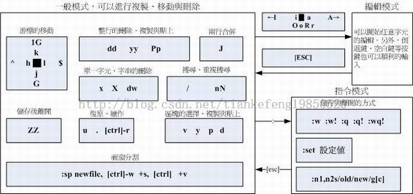

# Linux 学习记录--vim 与 vi 常用命令

# vim 与 vi 常用命令  

###语系编码转换：iconv  
vi 是个文本编辑器，所有 UNIX Like 系统都会内置这个编辑器   
vim 是 vi 的强加版，其具有程序编辑的能力，可以主动以字体颜色辨识语法的正确性。    
###常用命令  

## 移动光标的方法   

<table cellpadding="0" cellspacing="0" border="1" width="95%"><tbody><tr><td>
h 或向左箭头键(←)
</td><td>
光标向左移动一个字符
</td></tr><tr><td>
j 或向下箭头键(↓)
</td><td>
光标向下移动一个字符
</td></tr><tr><td>
k 或向上箭头键(↑)
</td><td>
光标向上移动一个字符
</td></tr><tr><td>
l 或向右箭头键(→)
</td><td>
光标向右移动一个字符
</td></tr><tr><td colspan="2">
如果你将右手放在键盘上的话，你会发现   hjkl是排列在一起的，因此可以使用这四个按钮来移动光标。如果想要进行多次移动的话，例如向下移动 30行，可以使用 "30j" &nbsp;或 "30↓"的组合按键，亦即加上想要进行的次数(数字)后，按下动作即可.
</td></tr><tr><td>
[Ctrl] + [f]
</td><td>
屏幕[向下]移动一页，相当于 [Page Down]按键 (常用)
</td></tr><tr><td>
[Ctrl] + [b]
</td><td>
屏幕[向上]移动一页，相当于 [Page Up]按键 (常用)
</td></tr><tr><td>
[Ctrl] + [d]
</td><td>
屏幕[向下]移动半页
</td></tr><tr><td>
[Ctrl] + [u]
</td><td>
屏幕[向上]移动半页
</td></tr><tr><td>
+
</td><td>
光标移动到非空格符的下一列
</td></tr><tr><td>
-
</td><td>
光标移动到非空格符的上一列
</td></tr><tr><td>
n&lt;space&gt;
</td><td>
那个 n 表示[数字]，例如 20。按下数字后再按空格键，光标会向右移动这一行的 &nbsp; n 个字符。例如 20&lt;space&gt;则光标会向后面移动 20 &nbsp;个字符距离。
</td></tr><tr><td>
0 或功能键[Home]
</td><td>
这是数字[ 0 ]：移动到这一行的最前面字符处 (常用)
</td></tr><tr><td>
$ 或功能键[End]
</td><td>
移动到这一行的最后面字符处(常用)
</td></tr><tr><td>
H
</td><td>
光标移动到这个屏幕的最上方那一行的第一个字符
</td></tr><tr><td>
M
</td><td>
光标移动到这个屏幕的中央那一行的第一个字符
</td></tr><tr><td>
L
</td><td>
光标移动到这个屏幕的最下方那一行的第一个字符
</td></tr><tr><td>
G
</td><td>
移动到这个档案的最后一行(常用)
</td></tr><tr><td>
nG
</td><td>
n 为数字。移动到这个档案的第 n行。例如 20G &nbsp;则会移动到这个档案的第 20行(可配合 :set nu)
</td></tr><tr><td>
gg
</td><td>
移动到这个档案的第一行，相当于 1G啊. (常用)
</td></tr><tr><td>
n&lt;Enter&gt;
</td><td>
n 为数字。光标向下移动 n行(常用)
</td></tr></tbody></table>

## 搜寻与取代   

<table cellpadding="0" cellspacing="0" border="1" width="95%"><tbody><tr><td>
/word
</td><td>
向光标之下寻找一个名称为 word的字符串。例如要在档案内搜寻 asde &nbsp;这个字符串，就输入 /asde即可. (常用)
</td></tr><tr><td>
?word
</td><td>
向光标之上寻找一个字符串名称为 word的字符串。
</td></tr><tr><td>
n
</td><td>
这个 n 是英文按键。代表[重复前一个搜寻的动作]。举例来说，如果刚刚我们执行 /asde去向下搜寻 &nbsp; asde 这个字符串，则按下 n后，会向下继续搜寻下一个名称为 asde &nbsp;的字符串。如果是执行 ?asde的话，那么按下 n &nbsp;则会向上继续搜寻名称为 asde的字符串.
</td></tr><tr><td>
N
</td><td>
这个 N 是英文按键。与 n刚好相反，为[反向]进行前一个搜寻动作。例如 &nbsp; /asde后，按下 N 则表示[向上]搜寻 asde。
</td></tr><tr><td colspan="2">
使用 /word  &nbsp;配合 n 及 N是非常有帮助的.可以让你重复的找到一些你搜寻的关键词.
</td></tr><tr><td>
:n1,n2s/word1/word2/g
</td><td>
n1 与 n2为数字。在第 n1 &nbsp;与 n2行之间寻找 word1 &nbsp;这个字符串，并将该字符串取代为 word2 .举例来说，在 100到 200 &nbsp;行之间搜寻 asde并取代为 ASDE &nbsp;则： [:100,200s/asde/ASDE/g]。(常用)
</td></tr><tr><td>
:1,$s/word1/word2/g
</td><td>
从第一行到最后一行寻找 word1字符串，并将该字符串取代为 word2 .(常用)
</td></tr><tr><td>
:1,$s/word1/word2/gc
</td><td>
从第一行到最后一行寻找 word1字符串，并将该字符串取代为 word2 .且在取代前显示提示字符给用户确认 (confirm)是否需要取代.(常用)
</td></tr></tbody></table>

## 删除复制与粘贴   

<table cellpadding="0" cellspacing="0" border="1" width="95%"><tbody><tr><td>
x, X
</td><td>
在一行字当中，x  &nbsp;为向后删除一个字符 (相当于 [del]按键)， X为向前删除一个字符(相当于 &nbsp; [backspace]亦即是退格键) (常用)
</td></tr><tr><td>
nx
</td><td>
n 为数字，连续向后删除 n个字符。举例来说，我要连续删除 10 &nbsp;个字符， [10x]。
</td></tr><tr><td>
dd
</td><td>
删除游标所在的那一整列(常用)
</td></tr><tr><td>
ndd
</td><td>
n 为数字。删除光标所在的向下 n列，例如 20dd &nbsp;则是删除 20列 (常用)
</td></tr><tr><td>
d1G
</td><td>
删除光标所在到第一行的所有数据
</td></tr><tr><td>
dG
</td><td>
删除光标所在到最后一行的所有数据
</td></tr><tr><td>
d$
</td><td>
删除游标所在处，到该行的最后一个字符
</td></tr><tr><td>
d0
</td><td>
那个是数字的 0  &nbsp;，删除游标所在处，到该行的最前面一个字符
</td></tr><tr><td>
yy
</td><td>
复制游标所在的那一行(常用)
</td></tr><tr><td>
nyy
</td><td>
n 为数字。复制光标所在的向下 n列，例如 20yy &nbsp;则是复制 20列(常用)
</td></tr><tr><td>
y1G
</td><td>
复制游标所在列到第一列的所有数据
</td></tr><tr><td>
yG
</td><td>
复制游标所在列到最后一列的所有数据
</td></tr><tr><td>
y0
</td><td>
复制光标所在的那个字符到该行行首的所有数据
</td></tr><tr><td>
y$
</td><td>
复制光标所在的那个字符到该行行尾的所有数据
</td></tr><tr><td>
p, P
</td><td>
p 为将已复制的数据在光标下一行贴上，P则为贴在游标上一行. &nbsp;举例来说，目前光标在第 20行，且已经复制了 10 &nbsp;行数据。则按下 p后，那 10 &nbsp;行数据会贴在原本的 20行之后，亦即由 21 &nbsp;行开始贴。但如果是按下 P呢？那么原本的第 20 &nbsp;行会被推到变成 30行。 (常用)
</td></tr><tr><td>
J
</td><td>
将光标所在列与下一列的数据结合成同一列
</td></tr><tr><td>
c
</td><td>
重复删除多个数据，例如向下删除 10行，[ 10cj ]
</td></tr><tr><td>
u
</td><td>
复原前一个动作。(常用)
</td></tr><tr><td>
[Ctrl]+r
</td><td>
重做上一个动作。(常用)
</td></tr><tr><td>
.
</td><td>
意思是重复前一个动作的意思。如果你想要重复删除、重复贴上等等动作，按下小数点[.]就好了. (常用)
</td></tr></tbody></table>

## 进入插入和替换

<table cellpadding="0" cellspacing="0" border="1" width="95%"><tbody><tr><td>
i, I
</td><td>
进入插入模式(Insert mode)： i 为[从目前光标所在处插入]， I为[在目前所在行的第一个非空格符处开始插入]。 &nbsp; (常用)
</td></tr><tr><td>
a, A
</td><td>
进入插入模式(Insert mode)： a 为[从目前光标所在的下一个字符处开始插入]， A为[从光标所在行的最后一个字符处开始插入]。(常用)
</td></tr><tr><td>
o, O
</td><td>
进入插入模式(Insert mode)： 这是英文字母 o 的大小写。o为[在目前光标所在的下一行处插入新的一行]； &nbsp; O为在目前光标所在处的上一行插入新的一行.(常用)
</td></tr><tr><td>
r, R
</td><td>
进入取代模式(Replace mode)： r 只会取代光标所在的那一个字符一次；R会一直取代光标所在的文字，直到按下 ESC为止；(常用)
</td></tr><tr><td colspan="2">
上面这些按键中，在 vi  &nbsp;画面的左下角处会出现[--INSERT--]或[--REPLACE--]的字样。特别注意的是，我们上面也提过了，你想要在档案里面输入字符时，一定要在左下角处看到 INSERT或 REPLACE &nbsp;才能输入
</td></tr><tr><td>
[Esc]
</td><td>
退出编辑模式，回到一般模式中(常用)
</td></tr></tbody></table>

## 存储离开与文件保存

<table cellpadding="0" cellspacing="0" border="1" width="95%"><tbody><tr><td>
:w
</td><td>
将编辑的数据写入硬盘档案中(常用)
</td></tr><tr><td>
:w!
</td><td>
若文件属性为[只读]时，强制写入该档案。不过，到底能不能写入，还是跟你对该档案的档案权限有关啊.
</td></tr><tr><td>
:q
</td><td>
离开 vi (常用)
</td></tr><tr><td>
:q!
</td><td>
若曾修改过档案，又不想储存，使用 !为强制离开不储存档案。
</td></tr><tr><td colspan="2">
注意一下啊，那个惊叹号 (!)在 vi &nbsp;当中，常常具有[强制]的意思～
</td></tr><tr><td>
:wq
</td><td>
储存后离开，若为 :wq!  &nbsp;则为强制储存后离开 (常用)
</td></tr><tr><td>
ZZ
</td><td>
若档案没有更动，则不储存离开，若档案已经被更动过，则储存后离开.
</td></tr><tr><td>
:w [filename]
</td><td>
将编辑的数据储存成另一个档案（类似另存新档）
</td></tr><tr><td>
:r [filename]
</td><td>
在编辑的数据中，读入另一个档案的数据。亦即将 [filename]这个档案内容加到游标所在行后面
</td></tr><tr><td>
:n1,n2 w [filename]
</td><td>
将 n1 到 n2的内容储存成 filename &nbsp;这个档案。
</td></tr><tr><td>
:! command
</td><td>
暂时离开 vi  &nbsp;到指令列模式下执行 command 的显示结果.例如 [:! ls /home]即可在 vi当中察看 /home &nbsp;底下以 ls输出的档案信息.
</td></tr></tbody></table>

**vim环境设定与参数**

<table cellpadding="0" cellspacing="0" border="1" width="95%"><tbody><tr><td>
:set nu  &nbsp;:set nonu
</td><td>
就是设定与取消行号啊.
</td></tr><tr><td>
:set hlsearch  &nbsp;:set nohlsearch
</td><td>
hlsearch 就是 high light search(高亮度搜寻)。这个就是设定是否将搜寻的字符串反白的设定值。默认值是 hlsearch
</td></tr><tr><td>
:set autoindent  &nbsp;:set noautoindent
</td><td>
是否自动缩排？autoindent就是自动缩排。
</td></tr><tr><td>
:set backup
</td><td>
是否自动储存备份档？一般是 nobackup的，如果设定 backup &nbsp;的话，那么当你更动任何一个档案时，则源文件会被另存成一个档名为 filename~的档案。举例来说，我们编辑 hosts &nbsp;，设定 :set backup，那么当更动 hosts &nbsp;时，在同目录下，就会产生 hosts~文件名的档案，记录原始的 hosts &nbsp;档案内容
</td></tr><tr><td>
:set ruler
</td><td>
还记得我们提到的右下角的一些状态栏说明吗？这个 ruler就是在显示或不显示该设定值的 .
</td></tr><tr><td>
:set showmode
</td><td>
这个则是，是否要显示 --INSERT--之类的字眼在左下角的状态栏。
</td></tr><tr><td>
:set backspace=(012)
</td><td>
一般来说，如果我们按下 i  &nbsp;进入编辑模式后，可以利用退格键 (backspace) 来删除任意字符的。但是，某些 distribution则不许如此。此时，我们就可以透过 backspace &nbsp;来设定当 backspace为 2 &nbsp;时，就是可以删除任意值；0或 1 &nbsp;时，仅可删除刚刚输入的字符，而无法删除原本就已经存在的文字了.
</td></tr><tr><td>
:set all
</td><td>
显示目前所有的环境参数设定值。
</td></tr><tr><td>
:set
</td><td>
显示与系统默认值不同的设定参数，一般来说就是你有自行变动过的设定参数 .
</td></tr><tr><td>
:syntax on  &nbsp;:syntax off
</td><td>
是否依据程序相关语法显示不同颜色举例来说，在编辑一个纯文本档时，如果开头是以 #开始，那么该行就会变成蓝色。如果你懂得写程序，那么这个 :syntax on &nbsp;还会主动的帮你除错呢.但是，如果你仅是编写纯文本档案，要避免颜色对你的屏幕产生的干扰，则可以取消这个设定。
</td></tr><tr><td>
:set bg=dark  &nbsp;:set bg=light
</td><td>
可用以显示不同的颜色色调，预设是[ light ]。如果你常常发现批注的字体深蓝色实在很不容易看，那么这里可以设定为 dark.看看，会有不同的样式呢.
</td></tr></tbody></table>

**说明：如果不想每次都进行设置 VIM 环境，可以讲环境命令添加到~/.vimrc 中(此文件需自行创建)**
[root@localhost ~]# vim ~/.vimrc
 set hlsearch
 set backspace=2
 set autoindent
 set ruler
 set showmode
 set nu
 set bg=dark
 syntax on  
以下图列出常用命令

## 语系编码转换(iconv)
经常通过文本编辑器查看文字时会出现乱码，出现乱码的主要原因是环境的语系编码与文件的编码不一致导致的，比如系统语系是繁体中文(big5),文件语系是简体中文(gb2312)。
可以通过2种方式解决问题
**1：设置系统语系编码**
[root@localhost ~]# LANG GB2312
**2：语系转为和系统一致**
**语法**：iconv  --list
iconv –f 原编码 –t 新编码 filename [-o newfile]
**选项与参数：**
--list:列出支持的语系
-f:原编码
-t:新编码
-o file:保留源文件 file 为新文件名

本文出自 “StarFlex” 博客，请务必保留此出处[http://tiankefeng.blog.51cto.com/8687281/1372503](http://tiankefeng.blog.51cto.com/8687281/1372503)